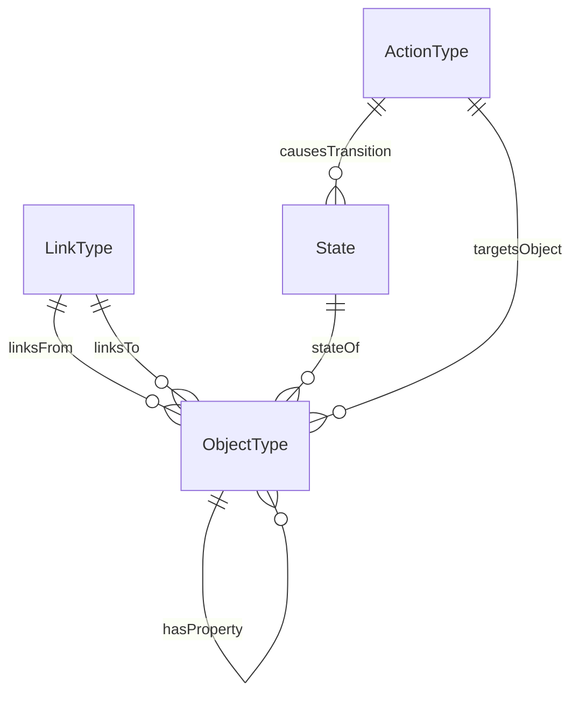
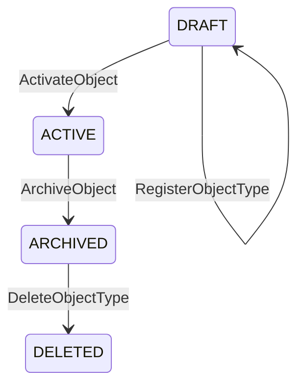

# 用 DuckDB 建模 Palantir Ontology 元结构：一篇可运行的完整教程

## 0. 为什么写这篇教程

Palantir Foundry 的 Ontology 层有四个元概念——**Object Type、Link Type、State、Action Type**——它们构成了任何业务场景的骨架。但大多数教程上来就用"航班""患者"等具体例子，读者看完仍然不清楚这四个概念**本身**的结构与约束。

本文反其道行之：**把 Ontology 自身当作被建模的业务领域**。你会在 DuckDB 里建出一套"描述 Ontology 的 Ontology（meta-ontology）"，通过运行 SQL 理解每个概念是什么、彼此如何协作，并在此过程中**穷尽 DuckDB 支持的各类操作**。

> **运行环境**：DuckDB ≥ 0.10（CLI / Python / WASM 均可）。所有 SQL 可从头到尾依次粘贴执行。

---

## 1. 概念速览：四块积木

| 元概念 | 一句话 | 类比 |
|--------|--------|------|
| **Object Type** | 对世界中某类实体的抽象，包含属性列表 | 类 / 表 |
| **Link Type** | 两个 Object Type 之间的有向关系 | 外键 / 边 |
| **State** | Object 在某一时刻的属性快照 + 生命周期阶段 | 行版本 / 状态机节点 |
| **Action Type** | 对 Object 执行的原子操作，驱动 State 转移 | 存储过程 / 事件 |

它们的协作闭环：

```
Action 作用于 Object → 产生新 State → State 变化可触发下游 Action → …
Link 连接不同 Object，使 Action 可以跨对象传播
```

---

## 2. 建库建模（DDL 全集）

### 2.1 创建数据库与 Schema

```sql
-- DuckDB 支持 ATTACH 多库；这里创建一个专用库
-- 如果在内存模式下运行，可跳过 ATTACH，直接建 SCHEMA
ATTACH ':memory:' AS ontology_db;
USE ontology_db;

CREATE SCHEMA IF NOT EXISTS meta;   -- 元模型 schema
SET search_path = 'meta';
```

### 2.2 ENUM 类型 —— 约束有限取值

```sql
-- DuckDB 原生支持 ENUM
CREATE TYPE meta.property_dtype AS ENUM (
    'STRING', 'INTEGER', 'DOUBLE', 'BOOLEAN',
    'DATE', 'TIMESTAMP', 'ARRAY', 'STRUCT', 'MAP', 'JSON'
);

CREATE TYPE meta.cardinality AS ENUM (
    'ONE_TO_ONE', 'ONE_TO_MANY', 'MANY_TO_ONE', 'MANY_TO_MANY'
);

CREATE TYPE meta.lifecycle_phase AS ENUM (
    'DRAFT', 'ACTIVE', 'SUSPENDED', 'ARCHIVED', 'DELETED'
);

CREATE TYPE meta.action_category AS ENUM (
    'CREATE', 'UPDATE', 'DELETE', 'TRANSITION', 'LINK', 'UNLINK', 'COMPOSITE'
);
```

### 2.3 核心表 —— SEQUENCE + 各种列约束

```sql
-- ── Object Type ──────────────────────────────────
CREATE SEQUENCE meta.seq_object_type START 1;

CREATE TABLE meta.object_type (
    ot_id        INTEGER   DEFAULT nextval('meta.seq_object_type') PRIMARY KEY,
    api_name     VARCHAR   NOT NULL UNIQUE,          -- 机器名
    display_name VARCHAR   NOT NULL,                 -- 人类名
    description  VARCHAR,
    icon         VARCHAR   DEFAULT '📦',
    created_at   TIMESTAMP DEFAULT current_timestamp,
    updated_at   TIMESTAMP DEFAULT current_timestamp,
    is_abstract  BOOLEAN   DEFAULT false,            -- 可作为"基类"
    tags         VARCHAR[]                            -- DuckDB 原生数组
);

-- ── Property（Object Type 的属性列表）────────────
CREATE SEQUENCE meta.seq_property START 1;

CREATE TABLE meta.property (
    prop_id      INTEGER            DEFAULT nextval('meta.seq_property') PRIMARY KEY,
    ot_id        INTEGER            NOT NULL REFERENCES meta.object_type(ot_id),
    api_name     VARCHAR            NOT NULL,
    display_name VARCHAR            NOT NULL,
    dtype        meta.property_dtype NOT NULL,
    is_primary   BOOLEAN            DEFAULT false,   -- 标记主键属性
    is_required  BOOLEAN            DEFAULT true,
    is_indexed   BOOLEAN            DEFAULT false,
    default_val  VARCHAR,                             -- 以 JSON 字符串存
    constraints  JSON,                                -- DuckDB JSON 列：{"min":0,"max":100}
    UNIQUE (ot_id, api_name)
);

-- ── Link Type ────────────────────────────────────
CREATE SEQUENCE meta.seq_link_type START 1;

CREATE TABLE meta.link_type (
    lt_id         INTEGER          DEFAULT nextval('meta.seq_link_type') PRIMARY KEY,
    api_name      VARCHAR          NOT NULL UNIQUE,
    display_name  VARCHAR          NOT NULL,
    from_ot_id    INTEGER          NOT NULL REFERENCES meta.object_type(ot_id),
    to_ot_id      INTEGER          NOT NULL REFERENCES meta.object_type(ot_id),
    cardinality   meta.cardinality NOT NULL,
    is_directed   BOOLEAN          DEFAULT true,
    description   VARCHAR,
    metadata      MAP(VARCHAR, VARCHAR)    -- DuckDB MAP 类型
);

-- ── State ────────────────────────────────────────
CREATE SEQUENCE meta.seq_state START 1;

CREATE TABLE meta.state (
    state_id       INTEGER              DEFAULT nextval('meta.seq_state') PRIMARY KEY,
    ot_id          INTEGER              NOT NULL REFERENCES meta.object_type(ot_id),
    phase          meta.lifecycle_phase NOT NULL,
    entered_at     TIMESTAMP            DEFAULT current_timestamp,
    snapshot       JSON,                             -- 完整属性快照
    changed_by     VARCHAR,                          -- 记录操作者
    change_reason  VARCHAR,
    checksum       VARCHAR,                          -- 快照校验和
    UNIQUE (ot_id, phase, entered_at)                -- 复合唯一
);

-- ── Action Type ──────────────────────────────────
CREATE SEQUENCE meta.seq_action_type START 1;

CREATE TABLE meta.action_type (
    at_id          INTEGER              DEFAULT nextval('meta.seq_action_type') PRIMARY KEY,
    api_name       VARCHAR              NOT NULL UNIQUE,
    display_name   VARCHAR              NOT NULL,
    category       meta.action_category NOT NULL,
    target_ot_id   INTEGER              NOT NULL REFERENCES meta.object_type(ot_id),
    description    VARCHAR,
    parameters     JSON,                -- 入参定义 [{"name":"reason","type":"STRING","required":true}]
    preconditions  JSON,                -- 前置条件
    side_effects   VARCHAR[],           -- 可能触发的下游 Action api_name
    created_at     TIMESTAMP            DEFAULT current_timestamp
);

-- ── Action→State 桥表：一个 Action 引起的状态跃迁 ──
CREATE TABLE meta.action_state_transition (
    at_id         INTEGER              NOT NULL REFERENCES meta.action_type(at_id),
    from_phase    meta.lifecycle_phase NOT NULL,
    to_phase      meta.lifecycle_phase NOT NULL,
    PRIMARY KEY (at_id, from_phase)
);
```

### 2.4 索引

```sql
-- DuckDB 支持 ART 索引（自动为 PK/UNIQUE 创建），也可显式建
CREATE INDEX idx_prop_ot   ON meta.property(ot_id);
CREATE INDEX idx_state_ot  ON meta.state(ot_id);
CREATE INDEX idx_action_ot ON meta.action_type(target_ot_id);
```

### 2.5 VIEW：把元模型"拍平"

```sql
CREATE OR REPLACE VIEW meta.v_full_ontology AS
SELECT
    ot.api_name     AS object_type,
    p.api_name      AS property,
    p.dtype,
    p.is_primary,
    lt.api_name     AS link,
    lt.cardinality,
    at2.api_name    AS action,
    at2.category
FROM meta.object_type ot
LEFT JOIN meta.property    p   ON p.ot_id = ot.ot_id
LEFT JOIN meta.link_type   lt  ON lt.from_ot_id = ot.ot_id
LEFT JOIN meta.action_type at2 ON at2.target_ot_id = ot.ot_id;
```

---

## 3. 灌入元数据（DML 全集）

### 3.1 INSERT —— 定义 4 个 Object Type（描述 Ontology 自身）

```sql
INSERT INTO meta.object_type (api_name, display_name, description, icon, tags) VALUES
    ('ObjectType',  'Object Type',  'Describes a class of real-world entities',   '📦', ARRAY['core','meta']),
    ('LinkType',    'Link Type',    'Describes a directed relationship',           '🔗', ARRAY['core','meta']),
    ('State',       'State',        'A snapshot of an object at a point in time',  '📸', ARRAY['core','meta']),
    ('ActionType',  'Action Type',  'An atomic operation that drives state change','⚡', ARRAY['core','meta']);
```

### 3.2 INSERT —— 为每个 Object Type 定义属性

```sql
-- ObjectType 的属性
INSERT INTO meta.property (ot_id, api_name, display_name, dtype, is_primary, is_required, constraints) VALUES
    (1, 'ot_id',        'ID',           'INTEGER', true,  true,  '{"auto":true}'),
    (1, 'api_name',     'API Name',     'STRING',  false, true,  '{"maxLength":128}'),
    (1, 'display_name', 'Display Name', 'STRING',  false, true,  NULL),
    (1, 'is_abstract',  'Is Abstract',  'BOOLEAN', false, false, NULL);

-- LinkType 的属性
INSERT INTO meta.property (ot_id, api_name, display_name, dtype, is_primary, is_required, constraints) VALUES
    (2, 'lt_id',       'ID',          'INTEGER', true,  true,  '{"auto":true}'),
    (2, 'api_name',    'API Name',    'STRING',  false, true,  NULL),
    (2, 'from_ot_id',  'From Object', 'INTEGER', false, true,  NULL),
    (2, 'to_ot_id',    'To Object',   'INTEGER', false, true,  NULL),
    (2, 'cardinality', 'Cardinality', 'STRING',  false, true,  NULL);

-- State 的属性
INSERT INTO meta.property (ot_id, api_name, display_name, dtype, is_primary, is_required, constraints) VALUES
    (3, 'state_id',   'ID',        'INTEGER',   true,  true,  NULL),
    (3, 'phase',      'Phase',     'STRING',    false, true,  NULL),
    (3, 'snapshot',   'Snapshot',  'JSON',      false, false, NULL),
    (3, 'entered_at', 'Entered',   'TIMESTAMP', false, true,  NULL);

-- ActionType 的属性
INSERT INTO meta.property (ot_id, api_name, display_name, dtype, is_primary, is_required, constraints) VALUES
    (4, 'at_id',       'ID',         'INTEGER', true,  true,  NULL),
    (4, 'api_name',    'API Name',   'STRING',  false, true,  NULL),
    (4, 'category',    'Category',   'STRING',  false, true,  NULL),
    (4, 'parameters',  'Parameters', 'JSON',    false, false, NULL);
```

### 3.3 INSERT —— 定义 Link Types（元概念间的关系）

```sql
INSERT INTO meta.link_type (api_name, display_name, from_ot_id, to_ot_id, cardinality, description, metadata) VALUES
    ('hasProperty',    'has Property',     1, 1, 'ONE_TO_MANY',  'ObjectType owns Properties',
        MAP {'inverse': 'belongsTo'}),
    ('linksFrom',      'links From',       2, 1, 'MANY_TO_ONE',  'LinkType starts at an ObjectType',
        MAP {'role': 'source'}),
    ('linksTo',        'links To',         2, 1, 'MANY_TO_ONE',  'LinkType ends at an ObjectType',
        MAP {'role': 'target'}),
    ('stateOf',        'state Of',         3, 1, 'MANY_TO_ONE',  'State belongs to an ObjectType',
        MAP {}),
    ('targetsObject',  'targets Object',   4, 1, 'MANY_TO_ONE',  'ActionType targets an ObjectType',
        MAP {}),
    ('causesTransition','causes Transition',4, 3, 'ONE_TO_MANY', 'Action drives state change',
        MAP {'semantic': 'causal'});
```

### 3.4 INSERT —— 定义 Action Types

```sql
INSERT INTO meta.action_type
    (api_name, display_name, category, target_ot_id, description, parameters, preconditions, side_effects) VALUES
    ('RegisterObjectType',  'Register Object Type',  'CREATE',     1,
        'Create a new Object Type in the ontology',
        '[{"name":"api_name","type":"STRING","required":true},
          {"name":"display_name","type":"STRING","required":true}]',
        '{"current_phase":null}',
        ARRAY['LogAudit']),

    ('AddProperty',         'Add Property',          'UPDATE',     1,
        'Add a property definition to an Object Type',
        '[{"name":"prop_api_name","type":"STRING","required":true},
          {"name":"dtype","type":"STRING","required":true}]',
        '{"current_phase":"ACTIVE"}',
        NULL),

    ('CreateLink',          'Create Link',           'LINK',       2,
        'Establish a link type between two Object Types',
        '[{"name":"from_ot","type":"INTEGER","required":true},
          {"name":"to_ot","type":"INTEGER","required":true}]',
        NULL,
        NULL),

    ('ActivateObject',      'Activate Object',       'TRANSITION', 1,
        'Move Object Type from DRAFT to ACTIVE',
        '[{"name":"reason","type":"STRING","required":false}]',
        '{"current_phase":"DRAFT"}',
        ARRAY['NotifySubscribers']),

    ('ArchiveObject',       'Archive Object',        'TRANSITION', 1,
        'Move Object Type to ARCHIVED',
        '[]',
        '{"current_phase":"ACTIVE"}',
        ARRAY['CascadeArchiveLinks']),

    ('DeleteObjectType',    'Delete Object Type',    'DELETE',     1,
        'Soft-delete an Object Type',
        '[]',
        '{"current_phase":"ARCHIVED"}',
        ARRAY['CascadeDeleteLinks','LogAudit']);
```

### 3.5 INSERT —— 状态跃迁规则

```sql
INSERT INTO meta.action_state_transition (at_id, from_phase, to_phase) VALUES
    (1, 'DRAFT',    'DRAFT'),     -- Register 创建即进入 DRAFT
    (4, 'DRAFT',    'ACTIVE'),    -- Activate
    (5, 'ACTIVE',   'ARCHIVED'),  -- Archive
    (6, 'ARCHIVED', 'DELETED');   -- Delete
```

### 3.6 INSERT —— 模拟生命周期（State 快照）

```sql
INSERT INTO meta.state (ot_id, phase, snapshot, changed_by, change_reason, checksum) VALUES
    (1, 'DRAFT',    '{"api_name":"ObjectType","property_count":0}',
        'admin', 'Initial registration', md5('{"api_name":"ObjectType","property_count":0}')),
    (1, 'ACTIVE',   '{"api_name":"ObjectType","property_count":4}',
        'admin', 'Properties defined, ready to use', md5('{"api_name":"ObjectType","property_count":4}')),
    (2, 'DRAFT',    '{"api_name":"LinkType","property_count":0}',
        'admin', 'Initial registration', md5('{"api_name":"LinkType","property_count":0}')),
    (2, 'ACTIVE',   '{"api_name":"LinkType","property_count":5}',
        'admin', 'All properties added', md5('{"api_name":"LinkType","property_count":5}')),
    (3, 'ACTIVE',   '{"api_name":"State","property_count":4}',
        'admin', 'Direct activation', md5('{"api_name":"State","property_count":4}')),
    (4, 'ACTIVE',   '{"api_name":"ActionType","property_count":4}',
        'admin', 'Direct activation', md5('{"api_name":"ActionType","property_count":4}'));
```

### 3.7 UPDATE / DELETE 演示

```sql
-- UPDATE：为 ObjectType 增加一个 tag
UPDATE meta.object_type
SET    tags = array_append(tags, 'foundational'),
       updated_at = current_timestamp
WHERE  api_name = 'ObjectType';

-- DELETE：删除一条测试用的假数据（先插后删）
INSERT INTO meta.property (ot_id, api_name, display_name, dtype) VALUES (1, '_tmp', 'Temp', 'STRING');
DELETE FROM meta.property WHERE api_name = '_tmp';
```

---

## 4. 查询全景（SELECT 操作大全）

### 4.1 基础查询 + 过滤 + 排序 + LIMIT

```sql
SELECT ot_id, api_name, display_name, tags
FROM   meta.object_type
WHERE  'core' = ANY(tags)      -- 数组元素过滤
ORDER  BY api_name
LIMIT  10;
```

### 4.2 聚合 + GROUP BY + HAVING

```sql
-- 每个 Object Type 有多少属性？哪些超过 3 个？
SELECT ot.api_name,
       count(p.prop_id) AS prop_count,
       count(*) FILTER (WHERE p.is_primary)  AS pk_count   -- FILTER 子句
FROM   meta.object_type ot
JOIN   meta.property p USING (ot_id)
GROUP  BY ot.api_name
HAVING count(p.prop_id) > 3;
```

### 4.3 多表 JOIN（INNER / LEFT / CROSS / SEMI / ANTI）

```sql
-- INNER JOIN：Object Type ↔ 它拥有的 Actions
SELECT ot.display_name AS object, at2.display_name AS action, at2.category
FROM   meta.object_type ot
INNER  JOIN meta.action_type at2 ON at2.target_ot_id = ot.ot_id;

-- LEFT JOIN：所有 Object Type 及其（可能为空的）最新 State
SELECT ot.api_name, s.phase, s.entered_at
FROM   meta.object_type ot
LEFT   JOIN meta.state s ON s.ot_id = ot.ot_id;

-- SEMI JOIN：只返回「至少有一个 Action」的 Object Type
SELECT ot.*
FROM   meta.object_type ot
WHERE  EXISTS (SELECT 1 FROM meta.action_type at2 WHERE at2.target_ot_id = ot.ot_id);

-- ANTI JOIN：找出「没有任何 State 记录」的 Object Type（应为 0 行）
SELECT ot.api_name
FROM   meta.object_type ot
WHERE  NOT EXISTS (SELECT 1 FROM meta.state s WHERE s.ot_id = ot.ot_id);

-- CROSS JOIN：所有可能的 Link 方向组合
SELECT a.api_name AS "from", b.api_name AS "to"
FROM   meta.object_type a
CROSS  JOIN meta.object_type b
WHERE  a.ot_id <> b.ot_id;
```

### 4.4 子查询 / CTE / 递归 CTE

```sql
-- CTE：每个 Object Type 的属性与 Action 数量合并
WITH prop_counts AS (
    SELECT ot_id, count(*) AS n_props FROM meta.property GROUP BY ot_id
), action_counts AS (
    SELECT target_ot_id AS ot_id, count(*) AS n_actions FROM meta.action_type GROUP BY target_ot_id
)
SELECT ot.api_name,
       coalesce(pc.n_props, 0)   AS properties,
       coalesce(ac.n_actions, 0) AS actions
FROM   meta.object_type ot
LEFT   JOIN prop_counts   pc USING (ot_id)
LEFT   JOIN action_counts ac USING (ot_id);

-- 递归 CTE：沿 Action 的 side_effects 链展开（模拟级联触发）
WITH RECURSIVE cascade AS (
    -- 种子：ArchiveObject
    SELECT api_name, side_effects, 0 AS depth
    FROM   meta.action_type
    WHERE  api_name = 'ArchiveObject'

    UNION ALL

    -- 展开 side_effects 数组里的每个名称
    SELECT at2.api_name, at2.side_effects, c.depth + 1
    FROM   cascade c,
           unnest(c.side_effects) AS t(effect_name)
    JOIN   meta.action_type at2 ON at2.api_name = t.effect_name
    WHERE  c.depth < 5   -- 防无限递归
)
SELECT * FROM cascade;
```

### 4.5 窗口函数

```sql
-- State 变化时间线：每个 Object Type 按时间排序，算出停留时长
SELECT
    ot.api_name,
    s.phase,
    s.entered_at,
    LEAD(s.entered_at) OVER w  AS next_entered,
    LEAD(s.entered_at) OVER w - s.entered_at AS duration,
    ROW_NUMBER()  OVER w AS seq,
    DENSE_RANK()  OVER (ORDER BY ot.api_name) AS type_rank,
    count(*) OVER (PARTITION BY ot.api_name)  AS total_states
FROM   meta.state s
JOIN   meta.object_type ot USING (ot_id)
WINDOW w AS (PARTITION BY s.ot_id ORDER BY s.entered_at)
ORDER  BY ot.api_name, s.entered_at;
```

### 4.6 集合操作 UNION / INTERSECT / EXCEPT

```sql
-- 哪些 api_name 同时出现在 Object Type 和 Action 中（语义检查）
SELECT api_name FROM meta.object_type
INTERSECT
SELECT api_name FROM meta.action_type;     -- 应为空

-- 所有"名称"汇总
SELECT api_name, 'ObjectType' AS source FROM meta.object_type
UNION ALL
SELECT api_name, 'LinkType'   FROM meta.link_type
UNION ALL
SELECT api_name, 'ActionType' FROM meta.action_type
ORDER BY source, api_name;
```

### 4.7 JSON / STRUCT / MAP / ARRAY 操作

```sql
-- 提取 Action 参数 JSON 数组的第一个元素名称
SELECT api_name,
       json_array_length(parameters)                       AS param_count,
       parameters->0->>'name'                              AS first_param,
       json_extract_string(parameters, '$[0].type')        AS first_type
FROM   meta.action_type
WHERE  parameters IS NOT NULL;

-- MAP 操作
SELECT api_name,
       metadata,
       map_keys(metadata)    AS keys,
       element_at(metadata, 'inverse')  AS inverse_link
FROM   meta.link_type;

-- STRUCT 构造
SELECT ot.api_name,
       {'prop_count': count(p.prop_id),
        'has_pk': bool_or(p.is_primary)} AS summary_struct
FROM   meta.object_type ot
JOIN   meta.property p USING (ot_id)
GROUP  BY ot.api_name;

-- ARRAY 聚合
SELECT ot.api_name,
       list(p.api_name ORDER BY p.api_name) AS all_properties   -- list() = array_agg()
FROM   meta.object_type ot
JOIN   meta.property p USING (ot_id)
GROUP  BY ot.api_name;

-- UNNEST 展开数组
SELECT ot.api_name, unnest(tags) AS tag
FROM   meta.object_type ot;
```

### 4.8 字符串 / 正则 / 日期

```sql
-- 字符串
SELECT api_name,
       upper(api_name)                  AS upper_name,
       length(api_name)                 AS name_len,
       regexp_extract(api_name, '([A-Z][a-z]+)', 1)  AS first_word,
       string_split(api_name, 'Type')   AS split_result
FROM   meta.object_type;

-- 日期
SELECT api_name,
       created_at,
       date_part('hour', created_at)    AS hour,
       strftime(created_at, '%Y-%m-%d') AS formatted,
       current_timestamp - created_at   AS age
FROM   meta.object_type;
```

### 4.9 PIVOT / UNPIVOT（DuckDB 特色）

```sql
-- PIVOT：属性数量按 dtype 展开为列
PIVOT (
    SELECT ot.api_name AS object_type, p.dtype, count(*) AS cnt
    FROM   meta.property p
    JOIN   meta.object_type ot USING (ot_id)
    GROUP  BY ALL
)
ON dtype
USING sum(cnt)
GROUP BY object_type;

-- UNPIVOT：把 object_type 宽表的几个字段竖着看
UNPIVOT meta.object_type
ON api_name, display_name, description
INTO NAME attribute VALUE val;
```

### 4.10 CASE / COALESCE / NULLIF / CAST

```sql
SELECT api_name,
       CASE category
           WHEN 'CREATE'     THEN '🆕 New'
           WHEN 'TRANSITION' THEN '🔄 Move'
           WHEN 'DELETE'     THEN '🗑️ Remove'
           ELSE '🔧 Other'
       END                                         AS emoji_cat,
       coalesce(description, '(no description)')   AS desc_safe,
       nullif(description, '')                      AS desc_null_if_empty,
       CAST(at_id AS VARCHAR) || '-' || api_name    AS composite_key
FROM   meta.action_type;
```

---

## 5. 高级 DuckDB 特性演练

### 5.1 MACRO（参数化 SQL 片段）

```sql
-- 标量宏
CREATE OR REPLACE MACRO meta.ontology_label(kind, name) AS
    kind || '::' || name;

SELECT meta.ontology_label('ObjectType', api_name) AS label
FROM   meta.object_type;

-- 表宏
CREATE OR REPLACE MACRO meta.props_of(target_api_name) AS TABLE
    SELECT p.*
    FROM   meta.property p
    JOIN   meta.object_type ot USING (ot_id)
    WHERE  ot.api_name = target_api_name;

SELECT * FROM meta.props_of('State');
```

### 5.2 LAMBDA + list_transform / list_filter

```sql
SELECT api_name,
       tags,
       list_transform(tags, x -> upper(x))                AS upper_tags,
       list_filter(tags, x -> len(x) > 4)                 AS long_tags,
       list_reduce(tags, (a, b) -> a || '+' || b)         AS joined
FROM   meta.object_type;
```

### 5.3 生成列（Generated Column）

```sql
-- 用 ALTER TABLE 添加一个虚拟生成列
ALTER TABLE meta.object_type ADD COLUMN IF NOT EXISTS
    tag_count INTEGER GENERATED ALWAYS AS (array_length(tags));

SELECT api_name, tags, tag_count FROM meta.object_type;
```

### 5.4 SAMPLE / TABLESAMPLE

```sql
-- 随机取 2 条属性
SELECT * FROM meta.property USING SAMPLE 2;
```

### 5.5 EXPLAIN / EXPLAIN ANALYZE

```sql
EXPLAIN ANALYZE
SELECT ot.api_name, count(*)
FROM   meta.object_type ot
JOIN   meta.property p USING (ot_id)
GROUP  BY ot.api_name;
```

### 5.6 EXPORT / COPY —— 读写外部文件

```sql
-- 导出到 Parquet（DuckDB 王牌格式）
COPY meta.object_type TO '/tmp/object_type.parquet' (FORMAT PARQUET);

-- 导出到 CSV
COPY meta.property   TO '/tmp/property.csv'   (HEADER, DELIMITER ',');

-- 导出到 JSON
COPY meta.link_type  TO '/tmp/link_type.json' (FORMAT JSON, ARRAY true);

-- 从 Parquet 读回来（演示 read_parquet）
SELECT * FROM read_parquet('/tmp/object_type.parquet');

-- 直接查询远程 CSV（如果联网，可换成真实 URL）
-- SELECT * FROM read_csv_auto('https://example.com/data.csv');
```

### 5.7 TEMP TABLE + INSERT ... SELECT + CREATE TABLE AS

```sql
-- CTAS
CREATE TEMP TABLE action_summary AS
    SELECT category, count(*) AS n, list(api_name) AS actions
    FROM   meta.action_type
    GROUP  BY category;

SELECT * FROM action_summary;

-- INSERT INTO ... SELECT
CREATE TEMP TABLE all_names (kind VARCHAR, name VARCHAR);
INSERT INTO all_names
    SELECT 'Object', api_name FROM meta.object_type
    UNION ALL
    SELECT 'Link',   api_name FROM meta.link_type
    UNION ALL
    SELECT 'Action', api_name FROM meta.action_type;

SELECT * FROM all_names ORDER BY kind, name;
```

### 5.8 事务控制

```sql
BEGIN TRANSACTION;

INSERT INTO meta.state (ot_id, phase, snapshot, changed_by, change_reason)
VALUES (1, 'SUSPENDED', '{"api_name":"ObjectType","note":"maintenance"}', 'dba', 'Planned maintenance');

-- 查看插入结果
SELECT * FROM meta.state WHERE phase = 'SUSPENDED';

-- 决定回滚
ROLLBACK;

-- 确认已回滚
SELECT * FROM meta.state WHERE phase = 'SUSPENDED';  -- 0 行
```

### 5.9 QUALIFY（窗口函数后置过滤）

```sql
-- 每个 Object Type 只保留最新 State
SELECT ot.api_name, s.phase, s.entered_at
FROM   meta.state s
JOIN   meta.object_type ot USING (ot_id)
QUALIFY ROW_NUMBER() OVER (PARTITION BY s.ot_id ORDER BY s.entered_at DESC) = 1;
```

### 5.10 GROUPING SETS / CUBE / ROLLUP

```sql
SELECT
    ot.api_name                      AS object_type,
    p.dtype::VARCHAR                 AS data_type,
    GROUPING(ot.api_name)            AS grp_ot,
    GROUPING(p.dtype)                AS grp_dtype,
    count(*)                         AS cnt
FROM   meta.property p
JOIN   meta.object_type ot USING (ot_id)
GROUP  BY CUBE (ot.api_name, p.dtype)
ORDER  BY grp_ot, grp_dtype, object_type, data_type;
```

### 5.11 LATERAL JOIN

```sql
-- 每个 Object Type 取其最早 2 条 State
SELECT ot.api_name, sub.*
FROM   meta.object_type ot,
       LATERAL (
           SELECT phase, entered_at
           FROM   meta.state s
           WHERE  s.ot_id = ot.ot_id
           ORDER  BY entered_at
           LIMIT 2
       ) sub;
```

### 5.12 VALUES 列表 + 内联表

```sql
-- 快速对照表（不建表也能用）
SELECT v.code, v.meaning
FROM   (VALUES ('ONE_TO_ONE',  '1:1'),
               ('ONE_TO_MANY', '1:N'),
               ('MANY_TO_ONE', 'N:1'),
               ('MANY_TO_MANY','M:N')) AS v(code, meaning);
```

### 5.13 信息查询（元数据之元数据）

```sql
-- 列出 meta schema 下所有表
SELECT table_name, column_count, estimated_size
FROM   duckdb_tables()
WHERE  schema_name = 'meta';

-- 列出列
SELECT table_name, column_name, data_type, is_nullable
FROM   information_schema.columns
WHERE  table_schema = 'meta'
ORDER  BY table_name, ordinal_position;

-- 列出约束
SELECT * FROM duckdb_constraints() WHERE schema_name = 'meta';
```

---

## 6. 验证元模型完整性（Data Quality Checks）

```sql
-- CHECK 1：每个 Object Type 至少有 1 个 is_primary 属性
SELECT ot.api_name, count(*) FILTER (WHERE p.is_primary) AS pk_count
FROM   meta.object_type ot
LEFT   JOIN meta.property p USING (ot_id)
GROUP  BY ot.api_name
HAVING count(*) FILTER (WHERE p.is_primary) = 0;
-- 期望 0 行

-- CHECK 2：Link 不能自环（from = to 且 api_name 不含 "self"）
SELECT *
FROM   meta.link_type
WHERE  from_ot_id = to_ot_id
  AND  api_name NOT ILIKE '%self%'
  AND  api_name NOT ILIKE '%has%';      -- hasProperty 是 OT→OT 关系，合法

-- CHECK 3：状态跃迁图中不存在不可达的终态
WITH reachable AS (
    SELECT DISTINCT to_phase AS phase FROM meta.action_state_transition
    UNION
    SELECT DISTINCT from_phase FROM meta.action_state_transition
)
SELECT e.enum_value AS unreachable_phase
FROM   (SELECT unnest(['DRAFT','ACTIVE','SUSPENDED','ARCHIVED','DELETED']::lifecycle_phase[]) AS enum_value) e
LEFT   JOIN reachable r ON r.phase = e.enum_value
WHERE  r.phase IS NULL;

-- CHECK 4：Action 的 side_effects 引用的 Action 必须存在
SELECT at1.api_name AS action, unnest(at1.side_effects) AS missing_effect
FROM   meta.action_type at1
WHERE  at1.side_effects IS NOT NULL
  AND  unnest(at1.side_effects) NOT IN (SELECT api_name FROM meta.action_type);
```

---

## 7. 图：将整个元模型可视化为 Mermaid

用 DuckDB 直接**生成 Mermaid 代码**：

```sql
-- 生成 Mermaid ER 图
WITH lines AS (
    SELECT 1 AS ord, 'erDiagram' AS line
    UNION ALL
    SELECT 2, '    ' || f.api_name || ' ||--o{ ' || t.api_name || ' : "' || lt.api_name || '"'
    FROM   meta.link_type lt
    JOIN   meta.object_type f ON f.ot_id = lt.from_ot_id
    JOIN   meta.object_type t ON t.ot_id = lt.to_ot_id
)
SELECT line FROM lines ORDER BY ord;
```

输出粘贴到任何 Mermaid 渲染器即可看到：



---

## 8. 状态机可视化

```sql
-- 生成 Mermaid 状态图
WITH lines AS (
    SELECT 1 AS ord, 'stateDiagram-v2' AS line
    UNION ALL
    SELECT 2,
        '    ' || from_phase::VARCHAR || ' --> ' || to_phase::VARCHAR
        || ' : ' || at2.api_name
    FROM   meta.action_state_transition ast
    JOIN   meta.action_type at2 USING (at_id)
)
SELECT line FROM lines ORDER BY ord;
```



---

## 9. 如何复用到任意业务场景

这套元模型就是一个**工厂**。假设要建一个"供应链"Ontology，只需：

```sql
-- 1. 注册新 Object Type
INSERT INTO meta.object_type (api_name, display_name, tags) VALUES
    ('Warehouse', 'Warehouse', ARRAY['supply-chain']),
    ('Shipment',  'Shipment',  ARRAY['supply-chain']);

-- 2. 定义属性
INSERT INTO meta.property (ot_id, api_name, display_name, dtype, is_primary) VALUES
    (5, 'wh_id',    'Warehouse ID', 'STRING',  true),
    (5, 'capacity', 'Capacity',     'INTEGER', false),
    (6, 'ship_id',  'Shipment ID',  'STRING',  true),
    (6, 'status',   'Status',       'STRING',  false);

-- 3. 建 Link
INSERT INTO meta.link_type (api_name, display_name, from_ot_id, to_ot_id, cardinality) VALUES
    ('shipsFrom', 'ships From', 6, 5, 'MANY_TO_ONE');

-- 4. 建 Action
INSERT INTO meta.action_type (api_name, display_name, category, target_ot_id, parameters) VALUES
    ('DispatchShipment', 'Dispatch Shipment', 'TRANSITION', 6,
     '[{"name":"carrier","type":"STRING","required":true}]');

-- 5. 定义状态跃迁
INSERT INTO meta.action_state_transition VALUES
    (7, 'DRAFT', 'ACTIVE');   -- at_id=7 for DispatchShipment

-- 验证
SELECT * FROM meta.v_full_ontology WHERE object_type IN ('Warehouse','Shipment');
```

你定义的**任何业务域**都只是这个 meta schema 里的**数据行**，不需要改结构。

---

## 10. 清理

```sql
-- 按需
DROP SCHEMA IF EXISTS meta CASCADE;
DETACH ontology_db;
```

---

## 11. 操作清单总览（MECE 自检）

| 分类 | 涉及操作 | 对应章节 |
|------|----------|----------|
| **DDL** | CREATE SCHEMA / TABLE / VIEW / INDEX / SEQUENCE / TYPE(ENUM) / MACRO; ALTER TABLE; DROP | §2, §5.1, §5.3, §10 |
| **DML** | INSERT / UPDATE / DELETE / INSERT...SELECT | §3, §5.7 |
| **DQL 基础** | SELECT / WHERE / ORDER BY / LIMIT / DISTINCT | §4.1 |
| **聚合** | GROUP BY / HAVING / FILTER / GROUPING SETS / CUBE / ROLLUP | §4.2, §5.10 |
| **JOIN** | INNER / LEFT / CROSS / SEMI(EXISTS) / ANTI(NOT EXISTS) / LATERAL | §4.3, §5.11 |
| **子查询/CTE** | 标量子查询 / CTE / 递归 CTE | §4.4 |
| **窗口** | ROW_NUMBER / LEAD / DENSE_RANK / count OVER / WINDOW 子句 / QUALIFY | §4.5, §5.9 |
| **集合** | UNION / UNION ALL / INTERSECT / EXCEPT | §4.6 |
| **复杂类型** | JSON / STRUCT / MAP / ARRAY / UNNEST / list_transform / list_filter | §4.7, §5.2 |
| **字符串/正则/日期** | upper / regexp_extract / string_split / date_part / strftime | §4.8 |
| **PIVOT/UNPIVOT** | PIVOT ON ... USING / UNPIVOT ... INTO | §4.9 |
| **表达式** | CASE / COALESCE / NULLIF / CAST | §4.10 |
| **宏** | MACRO (标量 + 表) | §5.1 |
| **Lambda** | list_transform / list_filter / list_reduce | §5.2 |
| **Generated Column** | ALTER TABLE ADD ... GENERATED ALWAYS AS | §5.3 |
| **采样** | USING SAMPLE / TABLESAMPLE | §5.4 |
| **执行计划** | EXPLAIN / EXPLAIN ANALYZE | §5.5 |
| **IO** | COPY TO/FROM (Parquet/CSV/JSON) / read_parquet / read_csv_auto | §5.6 |
| **CTAS / Temp** | CREATE TEMP TABLE AS | §5.7 |
| **事务** | BEGIN / COMMIT / ROLLBACK | §5.8 |
| **元数据** | duckdb_tables() / information_schema / duckdb_constraints() | §5.13 |
| **VALUES** | 内联 VALUES 表 | §5.12 |
| **数据质量** | 约束检查查询 | §6 |
| **可视化生成** | SQL 生成 Mermaid | §7, §8 |

---

## 结语

你刚刚做了一件"自举"（bootstrap）的事：**用 SQL 建了一个描述 Ontology 的 Ontology**。

- **Object Type** = 你对世界的分类方式。
- **Link Type** = 分类之间的关系拓扑。
- **State** = 对象随时间演化的快照序列。
- **Action Type** = 驱动状态流转的原子操作，串联起来就是业务流程。

这四者缺一不可、互不重叠（MECE），它们合在一起就是 Palantir 把任何混乱的数据治理问题变成可操作图谱的核心抽象。把这套元模型导出为 Parquet，带去下一个项目，直接往里灌业务定义即可。