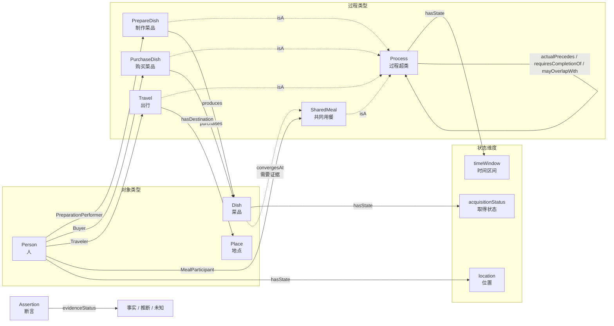

# 15 分钟掌握本体建模闭环

> 不只会拆案例，还能从案例抽象模型，再用模型分析新案例。

## 1. 一张图看懂完整闭环

事实拆解只回答“这次发生了什么”。本体建模还要继续回答：“这些事实背后有哪些稳定类型和关系，换一个案例还能不能使用？”

完整流程是：

~~~text
源案例
  ↓ 拆出实例事实
事实卡
  ↓ 从实例提炼稳定结构
本体蓝图
  ↓ 把新对象绑定到已有类型
新案例实例化
  ↓ 用同一组问题查询
复用验证
  ↓ 发现无法表达的重要问题
模型扩展
~~~

本体位于多个案例之上。它不是“我妈做了茄子”这张关系图，而是能够表达“某个人以制作角色参与某次制作过程，该过程形成一道菜”的通用结构。

学完后，你要能交付五项成果：事实卡、实例到类型映射、本体蓝图、新案例实例化表、能力问题与模型缺口表。

## 2. 第一步：从源案例提取实例

源案例是：

> 家里有我、我爸、我妈、我妻子。中午，我妈在家做了一道茄子；我骑车去川菜馆，买了西红柿牛腩和茄子炒长豆角，骑车回家，全家一起吃饭。

先区分三种证据：

| 类别 | 本案例中的内容 |
| --- | --- |
| 事实 | 四个人；母亲在家做菜；我外出购买两道菜；我回家；全家一起吃饭 |
| 推断 | 外购菜可能随我回家；三道菜可能是聚餐输入 |
| 未知 | 做菜与购买是否并发；每道菜是否上桌或被吃；是否必须等三道菜齐全 |

再列出需要持续追踪的实例：

- 人物实例：我、我爸、我妈、我妻子；
- 地点实例：家、川菜馆；
- 菜品实例：家做茄子菜、西红柿牛腩、茄子炒长豆角；
- 过程实例：制作、去程、购买、返程、共同用餐。

“家做茄子菜”和“茄子炒长豆角”都含“茄子”，但形成或取得过程不同，必须保持为两个实例。“我”去了川菜馆又回家，仍是同一人物，只是位置改变。

本步的输出是实例事实，不是本体。完成标准是：关键事实都有来源，推断和未知没有被常识补成事实。

## 3. 第二步：从实例抽象本体

抽象不是删掉细节，而是寻找多个同类案例都需要的稳定结构。

### 3.1 把专名换成类型

| 源案例实例 | 抽象类型 | 可复用含义 |
| --- | --- | --- |
| 我、我爸、我妈、我妻子 | Person 人 | 参与过程并保持身份的人 |
| 家、川菜馆 | Place 地点 | 过程发生或移动指向的位置 |
| 三道具体菜 | Dish 菜品 | 需要区分来源与状态的菜品实例 |
| 在家做菜 | PrepareDish 制作菜品 | 形成一道菜的过程 |
| 去川菜馆、回家 | Travel 出行 | 改变人物位置的过程 |
| 购买两道菜 | PurchaseDish 购买菜品 | 人物购买菜品的过程 |
| 全家一起吃饭 | SharedMeal 共同用餐 | 多个人物共同参与的过程 |

把所有实例名称换掉后，定义仍然成立，才说明得到了类型。

### 3.2 补齐状态、角色和关系

只有类型还不够。本体还要规定这些类型怎样连接。

| 构件 | 本体中的定义 | 解决的问题 |
| --- | --- | --- |
| 状态 | Person.location、Dish.acquisitionStatus、Process.timeWindow | 同一对象此刻怎样 |
| 角色 | 制作执行者、出行者、购买者、用餐参与者 | 人在某次过程中起什么作用 |
| 作用关系 | produces、purchases、hasDestination、playsRoleIn | 过程具体怎样作用于对象 |
| 过程关系 | actualPrecedes、requiresCompletionOf、mayOverlapWith、convergesAt | 区分先后、依赖、并发和汇聚 |
| 证据等级 | 事实、推断、未知 | 结论能否确定回答 |

“我妈是人”是类型；“我妈是本次制作的执行者”是角色。角色必须绑定过程，不能变成人物的永久类型。

“我先去川菜馆，再购买，再回家”是事实先后。除非证据能回答“A 延误时，B 是否必然延误”，否则不能把先后升级为必要依赖。

### 3.3 形成可复用蓝图

这张图没有“我妈”“川菜馆”或具体菜名，因此可以接受新实例。实线表示模型定义的连接；指向共同用餐的虚线表示只有获得菜品汇聚证据后才能建立该关系。

本体还需要结构约束：同名对象不能自动合并；状态变化不能创建新对象；角色不能替代类型；先后不能自动变成依赖；一次事件不能自动产生普遍业务规则。

本步完成标准：本体不依赖源案例专名，能力问题所需的对象、状态、过程、角色、关系和约束都有承载位置。

## 4. 第三步：冻结模型后做盲测

复用测试必须在模型冻结后进行。测试案例和预期答案要提前准备，但建模阶段不能读取。这样可以避免先看答案、再补模型的自证循环。

本次盲测案例是：

> 晚上，我回到家时，我爸已经做好一道茄子，我妻子正在做另一道茄子。过了一会儿，我、我爸和我妻子一起吃晚饭。

它与源案例存在真正的结构差异：没有购买过程，有两个同名菜品、两个制作过程，并且明确出现了制作与回家的时间重叠。

模型冻结后，只能把新实例放入已有结构：

| 新实例 | 复用类型 | 角色或关系 |
| --- | --- | --- |
| 我、我爸、我妻子 | Person | 我是出行者；父亲和妻子是制作执行者；三人是用餐参与者 |
| 家 | Place | 出行目的地、制作地点和用餐语境地点 |
| 父亲做的茄子、妻子做的茄子 | Dish | 两道同名菜品保持为两个实例 |
| 父亲制作、妻子制作 | PrepareDish | 两个制作过程分别形成一道菜 |
| 我回家 | Travel | 人物位置变为家 |
| 三人吃晚饭 | SharedMeal | 三个人物共同参与 |

时间关系也直接复用既有结构：父亲制作先于我回家，妻子制作与我回家重叠，我回家先于用餐。材料没有说明用餐必须等待哪个过程，因此不能建立必要依赖。

“没有购买过程”不代表模型缺少 PurchaseDish。过程类型是可选结构，一个案例不产生某类过程实例，不构成模型缺口。

两道菜都叫“茄子”也不能自动合并。“一道”和“另一道”已经说明它们是两个对象，不同制作人和制作过程进一步提供了身份依据。

本步完成标准：冻结模型能够承载结构不同的新案例，测试期间不修改模型、案例或预期答案。

## 5. 第四步：比较预期答案与模型答案

“能回答”不能只靠模型自己宣布。每个能力问题都要同时保存建模前冻结的预期答案和冻结模型生成的实际答案。

| 能力问题 | 盲测预期 | 模型实际答案 | 判定 |
| --- | --- | --- | --- |
| 有哪些实例和过程？ | 3 人、1 地点、2 道菜、4 个过程 | 完整映射到 Person、Place、Dish、PrepareDish、Travel、SharedMeal | MATCH |
| 两道“茄子”是不是同一实例？ | 不是 | 按“一道/另一道”和独立制作过程保持两个实例 | MATCH |
| 菜品怎样进入案例？ | 两道都由制作形成，没有购买 | 两个 PrepareDish 分别 produces 一道 Dish | MATCH |
| 人物承担什么角色？ | 两名制作执行者、一个出行者、三名用餐参与者 | 既有角色完整承载 | MATCH |
| 过程有什么时间关系？ | 先于、重叠、再先于；没有必要依赖 | actualPrecedes 与 mayOverlapWith 完整表达 | MATCH |
| 哪些仍是未知？ | 菜品是否被吃、妻子是否完成制作 | 两项都保留为未知 | MATCH |

本次八个能力问题全部 MATCH，因此复用通过。若实际答案漏掉实例、合并了两道菜、虚构购买过程或把先后升级成必要依赖，都必须记为 MISMATCH，而不是在测试阶段修改模型。

发现新信息时按三类处理：

1. **直接复用**：已有类型和关系能表达，只需增加实例；
2. **扩展模型**：信息影响能力问题，但当前本体没有表达位置；
3. **超出范围**：问题不属于家庭聚餐目标，例如燃油、营养或付款。

出现 MISMATCH 时先判断归属：事实理解错误退回事实基线；模型无法表达预期答案退回本体抽象；问题本身超出范围则保持范围外。只有定位完成后才能开启新的模型版本并重新盲测。

本体完成不是“概念足够多”，而是：范围明确、问题可答、未知可保留、新案例可实例化、必要扩展可回归。

## 6. 可复制的闭环模板

按下面五步分析任何新主题。注意：分析流程可以跨领域复用，但“家庭聚餐本体”的类型只能复用于其声明范围。

| 步骤 | 输入 | 动作 | 输出 | 完成标准 |
| --- | --- | --- | --- | --- |
| 1. 冻结问题与盲测 | 使用目标、未建模案例 | 写能力问题和预期答案，隔离盲测材料 | 验收基准 | 建模前完成且测试期间不修改 |
| 2. 拆源实例 | 原始材料 | 区分事实、推断、未知，列对象和过程 | 事实卡 | 所有关键陈述都有证据等级 |
| 3. 抽象模型 | 事实卡、能力问题 | 把专名映射为稳定类型、状态、角色和关系 | 冻结本体 | 换掉实例名称后定义仍成立 |
| 4. 运行盲测 | 冻结本体、隔离案例 | 新增实例并生成每个问题的实际答案 | 实际答案 | 测试期间不修改模型 |
| 5. 比较与处理 | 预期答案、实际答案 | 标记 MATCH/MISMATCH，定位事实、模型或范围问题 | 验收决定 | 全部 MATCH 才通过 |

### 空白工作表

| 源实例 | 候选类型 | 身份、状态或角色依据 |
| --- | --- | --- |
|  |  |  |

| 本体构件 | 名称 | 定义 | 允许连接 |
| --- | --- | --- | --- |
| 对象/过程/角色/状态/关系/约束 |  |  |  |

| 新案例实例 | 复用类型 | 状态或关系 | 是否存在缺口 |
| --- | --- | --- | --- |
|  |  |  |  |

| 能力问题 | 盲测预期答案 | 模型实际答案 | MATCH/MISMATCH |
| --- | --- | --- | --- |
|  |  |  |  |

最后记住这条闭环：

> 拆解让你忠实理解一次案例；抽象让结构脱离案例；冻结模型后的盲测，才真正证明模型是否准确、可用和可复用。
