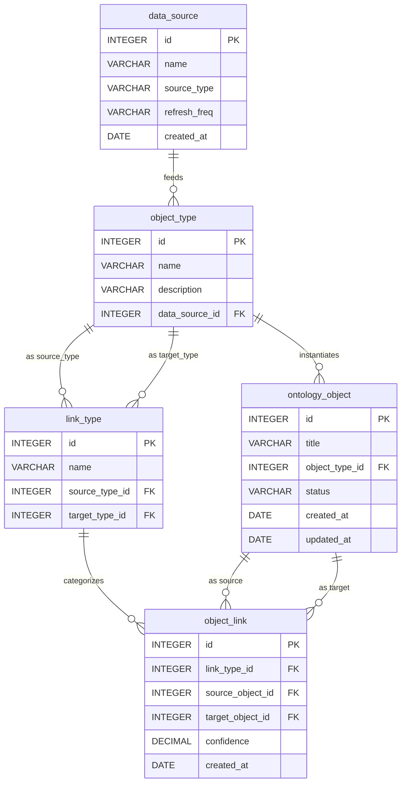

# DuckDB 系统化 SQL 教程 —— 以「Palantir 本体论（Ontology）」为例

---

## 目录总览

```
第一批次（本批）
  0. 前言与环境准备
  1. 领域建模与数据初始化（ER 图 + 建表 + 种子数据）
  2. 模块 A：CRUD 操作（A1 → A6）
     📸 数据快照

第二批次
  3. 模块 B：多表连接（B1 → B4）
  4. 模块 C：视图（C1 → C3）
  5. 模块 D：事务控制（D1 → D3）
     📸 数据快照
  6. 综合实战：端到端分析查询

第三批次
  7.  模块 E：窗口函数（E1 → E3）
  8.  模块 F：数据导入导出（F1 → F3）
  9.  模块 G：高级数据处理函数（G1 → G4）
  10. 模块 H：PIVOT 与高级聚合（H1 → H2）
  11. 模块 I：性能分析与调试（I1 → I3）
  12. 速查备忘表（Cheat Sheet）
  13. 完整知识地图
```

---

## 0. 前言与环境准备

### 背景

**Palantir 本体论（Ontology）** 是 Palantir Foundry 平台的核心抽象层。它将现实世界建模为：

```
数据源（Data Source）
  └─→ 对象类型（Object Type）
        └─→ 对象实例（Ontology Object）
              └─→ 链接关系（Object Link）─→ 另一个对象实例
                    ↑
              链接类型（Link Type）定义语义
```

本教程围绕一个 **简化的情报分析本体**，从零开始构建 5 张核心表，然后在这套真实数据上完整演练 DuckDB SQL 的所有能力。

### 环境要求

```sql
-- 确认 DuckDB 版本（建议 ≥ 1.0）
SELECT version();

-- 本教程所有 SQL 均可在以下环境直接运行：
--   · DuckDB CLI（命令行）
--   · Python：import duckdb; con = duckdb.connect()
--   · DBeaver / DataGrip 等 IDE
--   · Jupyter Notebook（通过 duckdb 或 magic_duckdb 插件）
-- 无需安装任何扩展
```

### 阅读约定

| 标记 | 含义 |
|------|------|
| `-- ← 新增` | 本步骤新插入的行 |
| `-- ← 已修改` | 本步骤修改过的字段 |
| `-- ← 已删除` | 本步骤删除的行 |
| 📸 | 当前所有表的完整数据快照 |
| ⚠️ | 易错点或生产环境注意事项 |

---

## 1. 领域建模与数据初始化

### 1.1 ER 关系图



### 关系说明

| 关系 | 类型 | 业务含义 |
|------|------|---------|
| `data_source → object_type` | 1:N | 一个数据源孵化多种对象类型 |
| `object_type → ontology_object` | 1:N | 一个类型有多个实例 |
| `object_type → link_type` | 1:N × 2 | 链接类型的源端和目标端各引用一个对象类型 |
| `ontology_object ↔ ontology_object` | M:N | 通过 `object_link` 中间表实现多对多 |

---

### 1.2 建表语句

```sql
-- ═══════════════════════════════════════
-- ① 数据源（根表，无外键依赖）
-- ═══════════════════════════════════════
CREATE TABLE data_source (
    id            INTEGER PRIMARY KEY,
    name          VARCHAR NOT NULL,
    source_type   VARCHAR NOT NULL,   -- signal | human | open_source | financial | geospatial | cyber
    refresh_freq  VARCHAR NOT NULL,   -- hourly | daily | weekly
    created_at    DATE    NOT NULL
);

-- ═══════════════════════════════════════
-- ② 对象类型（依赖 data_source）
-- ═══════════════════════════════════════
CREATE TABLE object_type (
    id              INTEGER PRIMARY KEY,
    name            VARCHAR NOT NULL,
    description     VARCHAR,
    data_source_id  INTEGER NOT NULL REFERENCES data_source(id)
);

-- ═══════════════════════════════════════
-- ③ 本体对象 / 实例（依赖 object_type）
-- ═══════════════════════════════════════
CREATE TABLE ontology_object (
    id              INTEGER PRIMARY KEY,
    title           VARCHAR NOT NULL,
    object_type_id  INTEGER NOT NULL REFERENCES object_type(id),
    status          VARCHAR NOT NULL DEFAULT 'active',
                    -- active | under_review | flagged | archived
    created_at      DATE    NOT NULL,
    updated_at      DATE
);

-- ═══════════════════════════════════════
-- ④ 链接类型（依赖 object_type × 2）
-- ═══════════════════════════════════════
CREATE TABLE link_type (
    id              INTEGER PRIMARY KEY,
    name            VARCHAR NOT NULL,
    source_type_id  INTEGER NOT NULL REFERENCES object_type(id),
    target_type_id  INTEGER NOT NULL REFERENCES object_type(id)
);

-- ═══════════════════════════════════════
-- ⑤ 对象链接（M:N 中间表）
-- ═══════════════════════════════════════
CREATE TABLE object_link (
    id                INTEGER PRIMARY KEY,
    link_type_id      INTEGER NOT NULL REFERENCES link_type(id),
    source_object_id  INTEGER NOT NULL REFERENCES ontology_object(id),
    target_object_id  INTEGER NOT NULL REFERENCES ontology_object(id),
    confidence        DECIMAL(3,2) NOT NULL,  -- 0.00 ~ 1.00
    created_at        DATE NOT NULL
);
```

---

### 1.3 种子数据

```sql
-- ═══ data_source（5 行）═══
INSERT INTO data_source VALUES
    (1, 'SIGINT Intercepts',  'signal',      'daily',  '2024-01-15'),
    (2, 'HUMINT Reports',     'human',       'weekly', '2024-02-01'),
    (3, 'OSINT Feeds',        'open_source', 'hourly', '2024-01-20'),
    (4, 'Financial Ledgers',  'financial',   'daily',  '2024-03-01'),
    (5, 'Satellite Imagery',  'geospatial',  'daily',  '2024-02-15');

-- ═══ object_type（5 行）═══
INSERT INTO object_type VALUES
    (1, 'Person',            'Human entity of interest',    2),
    (2, 'Organization',      'Group or institution',        3),
    (3, 'Location',          'Geographic point or area',    5),
    (4, 'Event',             'Time-bound occurrence',       1),
    (5, 'Financial_Account', 'Bank or crypto wallet',       4);

-- ═══ ontology_object（8 行）═══
INSERT INTO ontology_object VALUES
    (1, 'Alpha Operative',    1, 'active',       '2024-03-01', '2024-06-01'),
    (2, 'Bravo Contact',      1, 'active',       '2024-03-05', '2024-05-20'),
    (3, 'Shadow Network',     2, 'under_review', '2024-03-10', '2024-06-10'),
    (4, 'Delta Group',        2, 'active',       '2024-04-01', '2024-06-15'),
    (5, 'Warehouse 7',        3, 'active',       '2024-03-15', '2024-04-01'),
    (6, 'Port Facility Zulu', 3, 'archived',     '2024-03-20', '2024-05-01'),
    (7, 'Midnight Transfer',  4, 'active',       '2024-05-01', '2024-06-01'),
    (8, 'Account X-9182',     5, 'flagged',      '2024-04-10', '2024-06-20');

-- ═══ link_type（6 行）═══
INSERT INTO link_type VALUES
    (1, 'member_of',       1, 2),   -- Person → Organization
    (2, 'located_at',      1, 3),   -- Person → Location
    (3, 'participated_in', 1, 4),   -- Person → Event
    (4, 'funded_by',       2, 5),   -- Organization → Financial_Account
    (5, 'operates_at',     2, 3),   -- Organization → Location
    (6, 'owns_account',    1, 5);   -- Person → Financial_Account

-- ═══ object_link（7 行）═══
INSERT INTO object_link VALUES
    (1, 1, 1, 3, 0.92, '2024-04-01'),  -- Alpha Operative  → member_of       → Shadow Network
    (2, 1, 2, 4, 0.87, '2024-04-05'),  -- Bravo Contact    → member_of       → Delta Group
    (3, 2, 1, 5, 0.78, '2024-04-10'),  -- Alpha Operative  → located_at      → Warehouse 7
    (4, 3, 1, 7, 0.95, '2024-05-02'),  -- Alpha Operative  → participated_in → Midnight Transfer
    (5, 3, 2, 7, 0.65, '2024-05-03'),  -- Bravo Contact    → participated_in → Midnight Transfer
    (6, 4, 3, 8, 0.88, '2024-05-15'),  -- Shadow Network   → funded_by       → Account X-9182
    (7, 5, 4, 6, 0.91, '2024-05-20');  -- Delta Group      → operates_at     → Port Facility Zulu
```

> ✅ 所有 INSERT 语句可直接粘贴执行。外键引用完整、无悬挂。

---

## 2. 模块 A：CRUD 操作

---

### A1 ▸ INSERT — 数据写入

**🎯 解决什么问题**
将新发现的情报实体、数据源、关系录入本体，是构建知识图谱的第一步。

**📌 语法模板**

```sql
-- 单行 / 批量插入
INSERT INTO table_name (col1, col2, ...) 
VALUES (v1, v2, ...), (v1, v2, ...);

-- 从查询插入（跨表搬运）
INSERT INTO target_table 
SELECT ... FROM source_table WHERE ...;

-- DuckDB 特有：RETURNING（返回刚插入的行，立即确认）
INSERT INTO table_name VALUES (...) RETURNING *;
```

**💻 可执行示例**

```sql
-- 示例 1：新增一个数据源 + 使用 RETURNING 确认写入
INSERT INTO data_source VALUES
    (6, 'Cyber Threat Intel', 'cyber', 'hourly', '2024-06-01')  -- ← 新增
RETURNING *;
```

**📊 预期输出（RETURNING）**

| id | name | source_type | refresh_freq | created_at |
|----|------|-------------|--------------|------------|
| 6 | Cyber Threat Intel | cyber | hourly | 2024-06-01 |

```sql
-- 示例 2：批量新增两个人员对象
INSERT INTO ontology_object VALUES
    (9,  'Charlie Asset',  1, 'active',  '2024-06-15', '2024-06-15'),  -- ← 新增
    (10, 'Echo Informant', 1, 'flagged', '2024-06-18', '2024-06-18')   -- ← 新增
RETURNING id, title, status;
```

**📊 预期输出**

| id | title | status |
|----|-------|--------|
| 9 | Charlie Asset | active |
| 10 | Echo Informant | flagged |

**⚠️ 易错点 / 最佳实践**

1. DuckDB 主键不自增——需手动管理 ID 或使用 `CREATE SEQUENCE seq_name START 1; INSERT INTO t VALUES (nextval('seq_name'), ...)`
2. `RETURNING` 是验证写入的利器，生产中建议始终添加
3. 批量 `INSERT INTO ... SELECT` 比逐行插入快数个量级（向量化执行）

**🔗 上下文衔接**
数据已入库，下一节将通过 SELECT 查询验证并探索这些数据。

---

### A2 ▸ SELECT 基础查询

**🎯 解决什么问题**
按条件检索本体对象——分析师每天做的第一件事：「让我看看现在有什么数据」。

**📌 语法模板**

```sql
SELECT [DISTINCT] col1 [AS alias], col2, ...
FROM table_name
WHERE condition
ORDER BY col [ASC | DESC]
LIMIT n;
```

**💻 可执行示例**

```sql
-- 示例 1：查找所有状态异常（非 active）的本体对象
SELECT id, title, status, created_at
FROM ontology_object
WHERE status != 'active'
ORDER BY created_at DESC;
```

**📊 预期输出**

| id | title | status | created_at |
|----|-------|--------|------------|
| 10 | Echo Informant | flagged | 2024-06-18 |
| 8 | Account X-9182 | flagged | 2024-04-10 |
| 6 | Port Facility Zulu | archived | 2024-03-20 |
| 3 | Shadow Network | under_review | 2024-03-10 |

```sql
-- 示例 2：去重 —— 查看所有不重复的对象状态值
SELECT DISTINCT status AS unique_status
FROM ontology_object
ORDER BY unique_status;
```

**📊 预期输出**

| unique_status |
|---------------|
| active |
| archived |
| flagged |
| under_review |

**⚠️ 易错点 / 最佳实践**

1. `WHERE` 中字符串比较默认区分大小写（`'Active' != 'active'`）；需要不区分时用 `ILIKE`
2. `LIMIT` 没有 `ORDER BY` 时返回结果不确定——调试可以，报表不行
3. `DISTINCT` 作用于 **所有选定列的组合**，不仅仅是第一列

**🔗 上下文衔接**
下一节将在基础查询上叠加聚合分析，回答「每种类型有多少个对象」等统计问题。

---

### A3 ▸ SELECT 聚合与分组

**🎯 解决什么问题**
统计本体规模——每种对象类型有多少实例？平均链接置信度如何？辅助决策者判断数据质量。

**📌 语法模板**

```sql
SELECT group_col, AGG_FUNC(measure_col)
FROM table_name
[WHERE ...]
GROUP BY group_col
HAVING AGG_FUNC(measure_col) condition;
```

**💻 可执行示例**

```sql
-- 示例 1：按对象类型统计实例数量
SELECT object_type_id,
       COUNT(*)           AS obj_count,
       MIN(created_at)    AS earliest,
       MAX(created_at)    AS latest
FROM ontology_object
GROUP BY object_type_id
ORDER BY obj_count DESC;
```

**📊 预期输出**

| object_type_id | obj_count | earliest | latest |
|----------------|-----------|----------|--------|
| 1 | 4 | 2024-03-01 | 2024-06-18 |
| 2 | 2 | 2024-03-10 | 2024-04-01 |
| 3 | 2 | 2024-03-15 | 2024-03-20 |
| 4 | 1 | 2024-05-01 | 2024-05-01 |
| 5 | 1 | 2024-04-10 | 2024-04-10 |

```sql
-- 示例 2：找出平均置信度低于 0.85 的链接类型（数据质量预警）
SELECT link_type_id,
       COUNT(*)                   AS link_count,
       ROUND(AVG(confidence), 2)  AS avg_confidence
FROM object_link
GROUP BY link_type_id
HAVING AVG(confidence) < 0.85
ORDER BY avg_confidence;
```

**📊 预期输出**

| link_type_id | link_count | avg_confidence |
|--------------|------------|----------------|
| 3 | 2 | 0.80 |
| 2 | 1 | 0.78 |

**⚠️ 易错点 / 最佳实践**

1. 执行顺序：`WHERE` 过滤行 → `GROUP BY` 分组 → `HAVING` 过滤组 → `SELECT` → `ORDER BY`
2. `SELECT` 中非聚合列 **必须** 出现在 `GROUP BY` 中（DuckDB 严格检查）
3. `ROUND()` 放在展示层即可，不要在 `HAVING` 判断中对已 ROUND 的值做比较（精度陷阱）

**🔗 上下文衔接**
下一节将用子查询和 CTE 解决「嵌套」分析问题——如找出参与了高置信度事件的所有人员。

---

### A4 ▸ SELECT 子查询与 CTE

**🎯 解决什么问题**
分析师经常需要「先查出一个中间结果，再基于它做进一步查询」。比如：找出所有参与了某次事件的人员。

**📌 语法模板**

```sql
-- 标量子查询（返回单值）
SELECT ... WHERE col = (SELECT AGG_FUNC(...) FROM ...);

-- IN 子查询（返回一列多行）
SELECT ... WHERE col IN (SELECT col FROM ... WHERE ...);

-- CTE（Common Table Expression，命名子查询）
WITH cte_name AS (
    SELECT ...
)
SELECT ... FROM cte_name ...;
```

**💻 可执行示例**

```sql
-- 示例 1：IN 子查询 —— 找出参与了 "Midnight Transfer" 事件的所有人员
SELECT id, title, status
FROM ontology_object
WHERE id IN (
    SELECT source_object_id
    FROM object_link
    WHERE target_object_id = 7    -- Midnight Transfer
      AND link_type_id = 3        -- participated_in
);
```

**📊 预期输出**

| id | title | status |
|----|-------|--------|
| 1 | Alpha Operative | active |
| 2 | Bravo Contact | active |

```sql
-- 示例 2：CTE —— 分步计算每个组织的链接数和平均置信度，然后筛选
WITH org_link_stats AS (
    SELECT ol.source_object_id   AS org_id,
           oo.title              AS org_name,
           COUNT(*)              AS total_links,
           ROUND(AVG(ol.confidence), 2) AS avg_conf
    FROM object_link ol
    JOIN ontology_object oo ON oo.id = ol.source_object_id
    WHERE oo.object_type_id = 2   -- Organization
    GROUP BY ol.source_object_id, oo.title
)
SELECT * FROM org_link_stats
WHERE avg_conf > 0.85
ORDER BY total_links DESC;
```

**📊 预期输出**

| org_id | org_name | total_links | avg_conf |
|--------|----------|-------------|----------|
| 4 | Delta Group | 1 | 0.91 |
| 3 | Shadow Network | 1 | 0.88 |

**⚠️ 易错点 / 最佳实践**

1. CTE 比嵌套子查询 **可读性高数倍**，优先使用
2. 标量子查询必须返回恰好 1 行 1 列，否则报错
3. DuckDB 支持递归 CTE（`WITH RECURSIVE`），适合遍历层级关系链

**🔗 上下文衔接**
数据已查透，下一节将修改既有数据——更新对象状态与置信度。

---

### A5 ▸ UPDATE — 数据修改

**🎯 解决什么问题**
情报随时间演变：对象状态需要升/降级，链接置信度需要根据新证据校准。

**📌 语法模板**

```sql
-- 基础更新
UPDATE table_name SET col = value WHERE condition;

-- 基于子查询的关联更新
UPDATE table_name SET col = (SELECT ... FROM ...) WHERE ...;
```

**💻 可执行示例**

```sql
-- 示例 1：将 Shadow Network 从 under_review 升级为 flagged
UPDATE ontology_object
SET status     = 'flagged',          -- ← 已修改
    updated_at = '2024-07-01'        -- ← 已修改
WHERE title = 'Shadow Network';

-- 验证
SELECT id, title, status, updated_at
FROM ontology_object WHERE id = 3;
```

**📊 预期输出**

| id | title | status | updated_at |
|----|-------|--------|------------|
| 3 | Shadow Network | flagged | 2024-07-01 |

```sql
-- 示例 2：将所有置信度低于 0.70 的链接统一提升 0.10（新证据佐证）
UPDATE object_link
SET confidence = LEAST(confidence + 0.10, 1.00)  -- ← 已修改，上限钳制到 1.00
WHERE confidence < 0.70;

-- 验证
SELECT id, confidence FROM object_link WHERE id = 5;
```

**📊 预期输出**

| id | confidence |
|----|------------|
| 5 | 0.75 |

> 原值 0.65 + 0.10 = 0.75 ✅

**⚠️ 易错点 / 最佳实践**

1. **永远加 WHERE** ——不带 WHERE 的 UPDATE 会修改全表所有行
2. 先用 `SELECT` 验证 WHERE 条件命中的行数，确认无误后再改成 `UPDATE`
3. `LEAST()` / `GREATEST()` 是防止数值溢出的安全钳位函数

**🔗 上下文衔接**
下一节演示如何安全删除过期数据。

---

### A6 ▸ DELETE — 数据删除

**🎯 解决什么问题**
归档过期对象、清理测试数据、移除误录入的链接。

**📌 语法模板**

```sql
-- 条件删除
DELETE FROM table_name WHERE condition;

-- 清空全表（比 DELETE 快，不可回滚）
TRUNCATE table_name;

-- 删除并查看被删除的行
DELETE FROM table_name WHERE condition RETURNING *;
```

**💻 可执行示例**

```sql
-- 示例 1：删除已归档的地点对象（Port Facility Zulu, id=6）
-- ⚠️ 先删除引用它的链接（避免外键悬挂）
DELETE FROM object_link
WHERE target_object_id = 6 OR source_object_id = 6;  -- ← 已删除 (link id=7)

-- 再删除对象本身
DELETE FROM ontology_object
WHERE id = 6;                                          -- ← 已删除
```

```sql
-- 示例 2：删除所有置信度仍低于 0.80 的链接（清理低质量关系）
DELETE FROM object_link
WHERE confidence < 0.80
RETURNING *;
```

**📊 预期输出（示例 2 RETURNING）**

| id | link_type_id | source_object_id | target_object_id | confidence | created_at |
|----|-------------|------------------|------------------|------------|------------|
| 3 | 2 | 1 | 5 | 0.78 | 2024-04-10 |
| 5 | 3 | 2 | 7 | 0.75 | 2024-05-03 |

**⚠️ 易错点 / 最佳实践**

1. 有外键引用时，**先删子表再删父表**（DuckDB 不自动级联删除）
2. `TRUNCATE` 不支持 WHERE，且不可回滚——慎用于生产
3. 删除前用 `SELECT COUNT(*) FROM ... WHERE ...` 预览影响行数

**🔗 上下文衔接**
CRUD 模块完成，下面拍一张数据快照，确认当前状态后进入 JOIN 模块。

---

### 📸 模块 A 结束 — 当前数据快照

```sql
SELECT * FROM data_source ORDER BY id;
```

| id | name | source_type | refresh_freq | created_at |
|----|------|-------------|--------------|------------|
| 1 | SIGINT Intercepts | signal | daily | 2024-01-15 |
| 2 | HUMINT Reports | human | weekly | 2024-02-01 |
| 3 | OSINT Feeds | open_source | hourly | 2024-01-20 |
| 4 | Financial Ledgers | financial | daily | 2024-03-01 |
| 5 | Satellite Imagery | geospatial | daily | 2024-02-15 |
| **6** | **Cyber Threat Intel** | **cyber** | **hourly** | **2024-06-01** |

> data_source 新增了 id=6

```sql
SELECT * FROM ontology_object ORDER BY id;
```

| id | title | object_type_id | status | created_at | updated_at |
|----|-------|----------------|--------|------------|------------|
| 1 | Alpha Operative | 1 | active | 2024-03-01 | 2024-06-01 |
| 2 | Bravo Contact | 1 | active | 2024-03-05 | 2024-05-20 |
| 3 | Shadow Network | 2 | **flagged** | 2024-03-10 | **2024-07-01** |
| 4 | Delta Group | 2 | active | 2024-04-01 | 2024-06-15 |
| 5 | Warehouse 7 | 3 | active | 2024-03-15 | 2024-04-01 |
| 7 | Midnight Transfer | 4 | active | 2024-05-01 | 2024-06-01 |
| 8 | Account X-9182 | 5 | flagged | 2024-04-10 | 2024-06-20 |
| **9** | **Charlie Asset** | **1** | **active** | **2024-06-15** | **2024-06-15** |
| **10** | **Echo Informant** | **1** | **flagged** | **2024-06-18** | **2024-06-18** |

> id=6 已删除；id=3 状态已修改；id=9, 10 新增

```sql
SELECT * FROM object_link ORDER BY id;
```

| id | link_type_id | source_object_id | target_object_id | confidence | created_at |
|----|-------------|------------------|------------------|------------|------------|
| 1 | 1 | 1 | 3 | 0.92 | 2024-04-01 |
| 2 | 1 | 2 | 4 | 0.87 | 2024-04-05 |
| 4 | 3 | 1 | 7 | 0.95 | 2024-05-02 |
| 6 | 4 | 3 | 8 | 0.88 | 2024-05-15 |

> link id=3, 5, 7 已删除（低置信度清理 + 级联清理）；剩余 4 条链接

```sql
-- object_type 和 link_type 未修改，保持原始 5 行和 6 行
```

> ⚠️ 以下所有 SQL 基于第一批次结束时的数据状态（data_source 6 行、ontology_object 9 行、object_link 4 行）。

---

## 3. 模块 B：多表连接

---

### B1 ▸ INNER JOIN — 精确匹配

**🎯 解决什么问题**
本体数据分散在 5 张表中，分析师需要将对象名称、类型名称、链接语义「拼」在一起才能看懂一条关系。INNER JOIN 只返回两侧都有匹配的行。

**📌 语法模板**

```sql
-- 两表连接
SELECT a.col, b.col
FROM table_a a
INNER JOIN table_b b ON a.fk = b.pk;

-- 多路连接（链式）
SELECT ...
FROM table_a a
INNER JOIN table_b b ON a.id = b.a_id
INNER JOIN table_c c ON b.id = c.b_id;

-- 自连接（同一张表 JOIN 自身）
SELECT a.col, b.col
FROM table_x a
INNER JOIN table_x b ON a.some_col = b.other_col;
```

**💻 可执行示例**

```sql
-- 示例 1：列出每个本体对象及其类型名称
SELECT oo.id,
       oo.title,
       ot.name   AS type_name,
       oo.status
FROM ontology_object oo
INNER JOIN object_type ot ON oo.object_type_id = ot.id
ORDER BY oo.id;
```

**📊 预期输出**

| id | title | type_name | status |
|----|-------|-----------|--------|
| 1 | Alpha Operative | Person | active |
| 2 | Bravo Contact | Person | active |
| 3 | Shadow Network | Organization | flagged |
| 4 | Delta Group | Organization | active |
| 5 | Warehouse 7 | Location | active |
| 7 | Midnight Transfer | Event | active |
| 8 | Account X-9182 | Financial_Account | flagged |
| 9 | Charlie Asset | Person | active |
| 10 | Echo Informant | Person | flagged |

```sql
-- 示例 2：三路 JOIN —— 展示完整的链接语义：「谁 → 什么关系 → 谁」
SELECT src.title      AS source_entity,
       lt.name        AS relationship,
       tgt.title      AS target_entity,
       ol.confidence
FROM object_link ol
INNER JOIN ontology_object src ON ol.source_object_id = src.id
INNER JOIN ontology_object tgt ON ol.target_object_id = tgt.id
INNER JOIN link_type lt        ON ol.link_type_id     = lt.id
ORDER BY ol.confidence DESC;
```

**📊 预期输出**

| source_entity | relationship | target_entity | confidence |
|---------------|-------------|---------------|------------|
| Alpha Operative | participated_in | Midnight Transfer | 0.95 |
| Alpha Operative | member_of | Shadow Network | 0.92 |
| Shadow Network | funded_by | Account X-9182 | 0.88 |
| Bravo Contact | member_of | Delta Group | 0.87 |

```sql
-- 示例 3：自连接 —— 找出属于同一种对象类型的「同类对」
SELECT a.title AS entity_a,
       b.title AS entity_b,
       ot.name AS shared_type
FROM ontology_object a
INNER JOIN ontology_object b  ON a.object_type_id = b.object_type_id
                             AND a.id < b.id     -- 避免重复对 & 自配对
INNER JOIN object_type ot     ON a.object_type_id = ot.id
ORDER BY shared_type, entity_a;
```

**📊 预期输出**

| entity_a | entity_b | shared_type |
|----------|----------|-------------|
| Shadow Network | Delta Group | Organization |
| Alpha Operative | Bravo Contact | Person |
| Alpha Operative | Charlie Asset | Person |
| Alpha Operative | Echo Informant | Person |
| Bravo Contact | Charlie Asset | Person |
| Bravo Contact | Echo Informant | Person |
| Charlie Asset | Echo Informant | Person |

**⚠️ 易错点 / 最佳实践**

1. INNER JOIN 会 **丢弃** 不匹配的行——如果某对象没有链接，它不会出现在示例 2 中
2. 多路 JOIN 时始终使用 **表别名**，避免列名歧义（`ol.id` vs `src.id`）
3. 自连接中 `a.id < b.id` 是经典去重技巧，防止 (A,B) 和 (B,A) 重复出现

**🔗 上下文衔接**
INNER JOIN 只返回匹配行。下一节用 LEFT JOIN 找出「孤立对象」——即没有任何链接关系的实体。

---

### B2 ▸ LEFT / RIGHT JOIN — 包含缺失

**🎯 解决什么问题**
找出没有任何关系的「孤岛」对象——这些可能是数据录入遗漏，也可能是需要优先补全的新线索。

**📌 语法模板**

```sql
-- LEFT JOIN：保留左表所有行，右表无匹配时填 NULL
SELECT a.*, b.col
FROM table_a a
LEFT JOIN table_b b ON a.id = b.fk;

-- 经典"找缺失"模式：LEFT JOIN + WHERE IS NULL
SELECT a.*
FROM table_a a
LEFT JOIN table_b b ON a.id = b.fk
WHERE b.pk IS NULL;
```

**💻 可执行示例**

```sql
-- 示例 1：LEFT JOIN —— 找出没有任何出站链接的对象（孤岛检测）
SELECT oo.id,
       oo.title,
       ot.name   AS type_name,
       ol.id     AS link_id       -- 无链接时为 NULL
FROM ontology_object oo
INNER JOIN object_type ot ON oo.object_type_id = ot.id
LEFT JOIN object_link ol  ON oo.id = ol.source_object_id
WHERE ol.id IS NULL
ORDER BY oo.id;
```

**📊 预期输出**

| id | title | type_name | link_id |
|----|-------|-----------|---------|
| 4 | Delta Group | Organization | NULL |
| 5 | Warehouse 7 | Location | NULL |
| 7 | Midnight Transfer | Event | NULL |
| 8 | Account X-9182 | Financial_Account | NULL |
| 9 | Charlie Asset | Person | NULL |
| 10 | Echo Informant | Person | NULL |

> 6 个对象没有发出任何链接

```sql
-- 示例 2：LEFT JOIN + COALESCE —— 每个对象的出站 & 入站链接数（含 0）
SELECT oo.id,
       oo.title,
       COALESCE(out_stats.out_count, 0) AS outgoing_links,
       COALESCE(in_stats.in_count, 0)   AS incoming_links,
       COALESCE(out_stats.out_count, 0)
         + COALESCE(in_stats.in_count, 0) AS total_links
FROM ontology_object oo
LEFT JOIN (
    SELECT source_object_id, COUNT(*) AS out_count
    FROM object_link
    GROUP BY source_object_id
) out_stats ON oo.id = out_stats.source_object_id
LEFT JOIN (
    SELECT target_object_id, COUNT(*) AS in_count
    FROM object_link
    GROUP BY target_object_id
) in_stats ON oo.id = in_stats.target_object_id
ORDER BY total_links DESC, oo.id;
```

**📊 预期输出**

| id | title | outgoing_links | incoming_links | total_links |
|----|-------|----------------|----------------|-------------|
| 1 | Alpha Operative | 2 | 0 | 2 |
| 3 | Shadow Network | 1 | 1 | 2 |
| 2 | Bravo Contact | 1 | 0 | 1 |
| 7 | Midnight Transfer | 0 | 1 | 1 |
| 8 | Account X-9182 | 0 | 1 | 1 |
| 4 | Delta Group | 0 | 1 | 1 |
| 5 | Warehouse 7 | 0 | 0 | 0 |
| 9 | Charlie Asset | 0 | 0 | 0 |
| 10 | Echo Informant | 0 | 0 | 0 |

**⚠️ 易错点 / 最佳实践**

1. `WHERE right_table.col IS NULL` **必须** 放在 `WHERE` 而非 `ON` 中，否则语义完全不同——放在 ON 中会被当作连接条件，左表行仍然保留
2. `COALESCE(value, 0)` 是处理 LEFT JOIN 产生的 NULL 的标准手法
3. DuckDB 完整支持 RIGHT JOIN，但实践中可通过 **交换左右表** 用 LEFT JOIN 替代，可读性更高

**🔗 上下文衔接**
下一节用 FULL OUTER JOIN 做全景数据对账，再用 CROSS JOIN 生成分析矩阵。

---

### B3 ▸ FULL OUTER JOIN + CROSS JOIN

**🎯 解决什么问题**
- **FULL OUTER JOIN**：合并两侧全部数据（用于数据对账——"哪些类型没有实例？哪些实例类型未定义？"）
- **CROSS JOIN**：生成笛卡尔积（用于组合分析矩阵——"所有可能的人-组织配对"）

**📌 语法模板**

```sql
-- FULL OUTER JOIN
SELECT a.col, b.col
FROM table_a a
FULL OUTER JOIN table_b b ON a.id = b.fk;

-- CROSS JOIN
SELECT a.col, b.col
FROM table_a a
CROSS JOIN table_b b;
-- 等价于：FROM table_a a, table_b b
```

**💻 可执行示例**

```sql
-- 示例 1：FULL OUTER JOIN —— 对账：类型定义 vs 实际实例
SELECT ot.name   AS type_name,
       oo.title  AS object_title,
       oo.status
FROM object_type ot
FULL OUTER JOIN ontology_object oo ON ot.id = oo.object_type_id
ORDER BY ot.name NULLS LAST, oo.title NULLS LAST;
```

**📊 预期输出**

| type_name | object_title | status |
|-----------|-------------|--------|
| Event | Midnight Transfer | active |
| Financial_Account | Account X-9182 | flagged |
| Location | Warehouse 7 | active |
| Organization | Delta Group | active |
| Organization | Shadow Network | flagged |
| Person | Alpha Operative | active |
| Person | Bravo Contact | active |
| Person | Charlie Asset | active |
| Person | Echo Informant | flagged |

> 本例中所有类型都有实例、所有实例都有类型，说明数据完整性良好。若出现 NULL，则表明数据缺失。

```sql
-- 示例 2：CROSS JOIN —— 生成「所有 Person × 所有 Organization」的潜在关联矩阵
SELECT p.title  AS person,
       o.title  AS organization
FROM ontology_object p
CROSS JOIN ontology_object o
WHERE p.object_type_id = 1   -- Person
  AND o.object_type_id = 2   -- Organization
ORDER BY p.title, o.title;
```

**📊 预期输出（4 人 × 2 组织 = 8 行）**

| person | organization |
|--------|-------------|
| Alpha Operative | Delta Group |
| Alpha Operative | Shadow Network |
| Bravo Contact | Delta Group |
| Bravo Contact | Shadow Network |
| Charlie Asset | Delta Group |
| Charlie Asset | Shadow Network |
| Echo Informant | Delta Group |
| Echo Informant | Shadow Network |

```sql
-- 进阶：CROSS JOIN + NOT EXISTS —— 找出「尚未建立 member_of 关系」的人-组织组合
SELECT p.title AS person,
       o.title AS organization
FROM ontology_object p
CROSS JOIN ontology_object o
WHERE p.object_type_id = 1
  AND o.object_type_id = 2
  AND NOT EXISTS (
      SELECT 1 FROM object_link ol
      WHERE ol.source_object_id = p.id
        AND ol.target_object_id = o.id
        AND ol.link_type_id = 1       -- member_of
  )
ORDER BY p.title, o.title;
```

**📊 预期输出（8 - 2 已建立 = 6 行）**

| person | organization |
|--------|-------------|
| Alpha Operative | Delta Group |
| Bravo Contact | Shadow Network |
| Charlie Asset | Delta Group |
| Charlie Asset | Shadow Network |
| Echo Informant | Delta Group |
| Echo Informant | Shadow Network |

**⚠️ 易错点 / 最佳实践**

1. CROSS JOIN 行数 = 左表行数 × 右表行数，**大表慎用**——1 万 × 1 万 = 1 亿行
2. FULL OUTER JOIN 两侧都可能出现 NULL，须同时 `COALESCE` 处理
3. `CROSS JOIN + NOT EXISTS` 是发现「数据空白」的经典模式

**🔗 上下文衔接**
下一节组合所有 JOIN 类型完成一个端到端的多表分析查询。

---

### B4 ▸ 综合连接实战

**🎯 解决什么问题**
一条 SQL 回答高管问题：**「每个数据源贡献了多少个对象类型、多少个对象实例、以及这些实例涉及多少条高置信度（≥0.85）链接？」**

**💻 可执行示例**

```sql
WITH high_conf_links AS (
    -- Step 1: 预聚合高置信度链接
    SELECT source_object_id,
           COUNT(*) AS hc_link_count
    FROM object_link
    WHERE confidence >= 0.85
    GROUP BY source_object_id
)
SELECT ds.name                              AS data_source,
       ds.source_type,
       ds.refresh_freq,
       COUNT(DISTINCT ot.id)                AS type_count,
       COUNT(DISTINCT oo.id)                AS object_count,
       COALESCE(SUM(hcl.hc_link_count), 0) AS high_conf_links
FROM data_source ds
LEFT JOIN object_type ot        ON ds.id  = ot.data_source_id
LEFT JOIN ontology_object oo    ON ot.id  = oo.object_type_id
LEFT JOIN high_conf_links hcl   ON oo.id  = hcl.source_object_id
GROUP BY ds.id, ds.name, ds.source_type, ds.refresh_freq
ORDER BY object_count DESC;
```

**📊 预期输出**

| data_source | source_type | refresh_freq | type_count | object_count | high_conf_links |
|-------------|-------------|-------------|------------|-------------|-----------------|
| HUMINT Reports | human | weekly | 1 | 4 | 3 |
| OSINT Feeds | open_source | hourly | 1 | 2 | 1 |
| Satellite Imagery | geospatial | daily | 1 | 1 | 0 |
| SIGINT Intercepts | signal | daily | 1 | 1 | 0 |
| Financial Ledgers | financial | daily | 1 | 1 | 0 |
| Cyber Threat Intel | cyber | hourly | 0 | 0 | 0 |

> 💡 Cyber Threat Intel 是新增的空数据源（无对象类型），LEFT JOIN 使其仍然出现在报表中。

**⚠️ 易错点 / 最佳实践**

1. CTE 先聚合再 JOIN，比在主查询中嵌入子查询效率高（DuckDB 优化器可更好规划）
2. `COUNT(DISTINCT ...)` 在多路 JOIN 中 **必不可少**，否则会因行膨胀而多计
3. 多层 LEFT JOIN 确保即使中间层缺数据，父层记录也不丢失

---

### 📸 模块 B 结束 — 数据快照

> 模块 B 为纯查询操作，**未修改任何数据**，快照与模块 A 结束时一致：
> - `data_source`：6 行
> - `object_type`：5 行（未变）
> - `ontology_object`：9 行（id = 1,2,3,4,5,7,8,9,10）
> - `link_type`：6 行（未变）
> - `object_link`：4 行（id = 1,2,4,6）

---

## 4. 模块 C：视图

---

### C1 ▸ CREATE VIEW — 创建、查询、修改、删除

**🎯 解决什么问题**
分析师不应每次都手写 20 行 JOIN。将复杂查询封装为视图，一句 `SELECT * FROM v_xxx` 即可复用。

**📌 语法模板**

```sql
-- 创建
CREATE VIEW view_name AS SELECT ...;

-- 创建或替换（原地更新）
CREATE OR REPLACE VIEW view_name AS SELECT ...;

-- 删除
DROP VIEW [IF EXISTS] view_name;
```

**💻 可执行示例**

```sql
-- 示例 1：创建「完整关系语义」视图
CREATE VIEW v_full_link AS
SELECT ol.id            AS link_id,
       src.title        AS source_entity,
       src_t.name       AS source_type,
       lt.name          AS relationship,
       tgt.title        AS target_entity,
       tgt_t.name       AS target_type,
       ol.confidence,
       ol.created_at    AS link_date
FROM object_link ol
JOIN ontology_object src   ON ol.source_object_id = src.id
JOIN object_type src_t     ON src.object_type_id  = src_t.id
JOIN ontology_object tgt   ON ol.target_object_id = tgt.id
JOIN object_type tgt_t     ON tgt.object_type_id  = tgt_t.id
JOIN link_type lt          ON ol.link_type_id      = lt.id;

-- 使用视图（一行搞定原来 6 个 JOIN 的查询）
SELECT * FROM v_full_link ORDER BY confidence DESC;
```

**📊 预期输出**

| link_id | source_entity | source_type | relationship | target_entity | target_type | confidence | link_date |
|---------|--------------|-------------|-------------|---------------|-------------|------------|-----------|
| 4 | Alpha Operative | Person | participated_in | Midnight Transfer | Event | 0.95 | 2024-05-02 |
| 1 | Alpha Operative | Person | member_of | Shadow Network | Organization | 0.92 | 2024-04-01 |
| 6 | Shadow Network | Organization | funded_by | Account X-9182 | Financial_Account | 0.88 | 2024-05-15 |
| 2 | Bravo Contact | Person | member_of | Delta Group | Organization | 0.87 | 2024-04-05 |

```sql
-- 示例 2：修改视图 —— 追加数据源信息列
CREATE OR REPLACE VIEW v_full_link AS
SELECT ol.id            AS link_id,
       src.title        AS source_entity,
       src_t.name       AS source_type,
       ds.name          AS data_origin,       -- ← 新增列
       lt.name          AS relationship,
       tgt.title        AS target_entity,
       tgt_t.name       AS target_type,
       ol.confidence,
       ol.created_at    AS link_date
FROM object_link ol
JOIN ontology_object src   ON ol.source_object_id = src.id
JOIN object_type src_t     ON src.object_type_id  = src_t.id
JOIN data_source ds        ON src_t.data_source_id = ds.id    -- ← 新增 JOIN
JOIN ontology_object tgt   ON ol.target_object_id = tgt.id
JOIN object_type tgt_t     ON tgt.object_type_id  = tgt_t.id
JOIN link_type lt          ON ol.link_type_id      = lt.id;

-- 验证新列
SELECT link_id, source_entity, data_origin, relationship, target_entity
FROM v_full_link
ORDER BY confidence DESC;
```

**📊 预期输出**

| link_id | source_entity | data_origin | relationship | target_entity |
|---------|--------------|-------------|-------------|---------------|
| 4 | Alpha Operative | HUMINT Reports | participated_in | Midnight Transfer |
| 1 | Alpha Operative | HUMINT Reports | member_of | Shadow Network |
| 6 | Shadow Network | OSINT Feeds | funded_by | Account X-9182 |
| 2 | Bravo Contact | HUMINT Reports | member_of | Delta Group |

```sql
-- 删除视图语法示例（暂不执行，后续还要用）
-- DROP VIEW IF EXISTS v_full_link;
```

**⚠️ 易错点 / 最佳实践**

1. 视图是 **虚拟表** ——每次查询视图都会重新执行底层 SQL，不存储数据
2. `CREATE OR REPLACE VIEW` 可原地修改，无需先 DROP 再 CREATE
3. 视图的列名变更不会自动通知下游——修改基表后务必验证视图是否仍然正确

**🔗 上下文衔接**
视图已创建。下一节展示视图在报表和仪表盘场景中的实际价值。

---

### C2 ▸ 视图的实际价值 — 封装、简化、隔离

**🎯 解决什么问题**
三大核心价值：
- **① 封装复杂性**：20 行 SQL → 1 行查询
- **② 报表层简化**：BI 工具直接对接视图
- **③ 逻辑隔离**：修改底层实现不影响上层消费者

**💻 可执行示例**

```sql
-- 创建「对象仪表盘」视图 —— 每个对象的类型、状态、出入站链接数一目了然
CREATE VIEW v_object_dashboard AS
SELECT oo.id,
       oo.title,
       ot.name                              AS type_name,
       oo.status,
       oo.created_at,
       oo.updated_at,
       COALESCE(out_links.cnt, 0)           AS outgoing,
       COALESCE(in_links.cnt, 0)            AS incoming,
       COALESCE(out_links.cnt, 0)
         + COALESCE(in_links.cnt, 0)        AS total_links
FROM ontology_object oo
JOIN object_type ot ON oo.object_type_id = ot.id
LEFT JOIN (
    SELECT source_object_id, COUNT(*) AS cnt
    FROM object_link GROUP BY 1
) out_links ON oo.id = out_links.source_object_id
LEFT JOIN (
    SELECT target_object_id, COUNT(*) AS cnt
    FROM object_link GROUP BY 1
) in_links ON oo.id = in_links.target_object_id;
```

```sql
-- 分析师日常：一行 SQL 看全貌
SELECT * FROM v_object_dashboard
ORDER BY total_links DESC, title;
```

**📊 预期输出**

| id | title | type_name | status | created_at | updated_at | outgoing | incoming | total_links |
|----|-------|-----------|--------|------------|------------|----------|----------|-------------|
| 1 | Alpha Operative | Person | active | 2024-03-01 | 2024-06-01 | 2 | 0 | 2 |
| 3 | Shadow Network | Organization | flagged | 2024-03-10 | 2024-07-01 | 1 | 1 | 2 |
| 2 | Bravo Contact | Person | active | 2024-03-05 | 2024-05-20 | 1 | 0 | 1 |
| 4 | Delta Group | Organization | active | 2024-04-01 | 2024-06-15 | 0 | 1 | 1 |
| 7 | Midnight Transfer | Event | active | 2024-05-01 | 2024-06-01 | 0 | 1 | 1 |
| 8 | Account X-9182 | Financial_Account | flagged | 2024-04-10 | 2024-06-20 | 0 | 1 | 1 |
| 5 | Warehouse 7 | Location | active | 2024-03-15 | 2024-04-01 | 0 | 0 | 0 |
| 9 | Charlie Asset | Person | active | 2024-06-15 | 2024-06-15 | 0 | 0 | 0 |
| 10 | Echo Informant | Person | flagged | 2024-06-18 | 2024-06-18 | 0 | 0 | 0 |

```sql
-- 基于视图做二次分析：按类型汇总
SELECT type_name,
       COUNT(*)          AS object_count,
       SUM(total_links)  AS total_links_in_type
FROM v_object_dashboard
GROUP BY type_name
ORDER BY total_links_in_type DESC;
```

**📊 预期输出**

| type_name | object_count | total_links_in_type |
|-----------|-------------|---------------------|
| Person | 4 | 3 |
| Organization | 2 | 3 |
| Event | 1 | 1 |
| Financial_Account | 1 | 1 |
| Location | 1 | 0 |

**⚠️ 最佳实践**

1. 视图命名建议统一前缀 `v_`，区分物理表
2. 视图上可以再建视图（嵌套），但不宜超过 3 层，否则调试困难
3. BI 工具（Metabase / Superset）直接连接视图做可视化，无需重写查询

**🔗 上下文衔接**
下一节介绍 DuckDB 的特有视图能力。

---

### C3 ▸ DuckDB 特有视图能力

**🎯 解决什么问题**
临时视图仅在当前会话存活，适合 ad-hoc 分析，不会污染全局命名空间。

**📌 语法模板**

```sql
-- 临时视图（会话级别，断开连接即消失）
CREATE TEMP VIEW view_name AS SELECT ...;

-- 物化替代方案（DuckDB 无原生 MATERIALIZED VIEW）
CREATE TABLE snapshot_name AS SELECT ...;
```

**💻 可执行示例**

```sql
-- 示例 1：临时视图 —— 当前会话的快速过滤器
CREATE TEMP VIEW v_flagged AS
SELECT id, title, status, updated_at
FROM ontology_object
WHERE status = 'flagged';

SELECT * FROM v_flagged ORDER BY updated_at DESC;
```

**📊 预期输出**

| id | title | status | updated_at |
|----|-------|--------|------------|
| 3 | Shadow Network | flagged | 2024-07-01 |
| 8 | Account X-9182 | flagged | 2024-06-20 |
| 10 | Echo Informant | flagged | 2024-06-18 |

```sql
-- 示例 2：物化快照 —— 将视图结果固化为物理表（手动物化视图）
CREATE TABLE t_dashboard_snapshot AS
    SELECT *, CURRENT_DATE AS snapshot_date
    FROM v_object_dashboard;

-- 快照是静态的——即使基础数据变了，快照不变
SELECT title, total_links, snapshot_date
FROM t_dashboard_snapshot
WHERE total_links > 0
ORDER BY total_links DESC;
```

**📊 预期输出**

| title | total_links | snapshot_date |
|-------|-------------|---------------|
| Alpha Operative | 2 | 2024-XX-XX |
| Shadow Network | 2 | 2024-XX-XX |
| Bravo Contact | 1 | 2024-XX-XX |
| Delta Group | 1 | 2024-XX-XX |
| Midnight Transfer | 1 | 2024-XX-XX |
| Account X-9182 | 1 | 2024-XX-XX |

> snapshot_date 为执行当天的日期

```sql
-- 清理快照表（用完即删）
DROP TABLE IF EXISTS t_dashboard_snapshot;
```

**⚠️ 易错点 / 最佳实践**

1. `CREATE TEMP VIEW` 仅在当前连接/会话内可见——Jupyter Notebook 重启后消失
2. DuckDB **不支持** `CREATE MATERIALIZED VIEW`，需用 `CREATE TABLE ... AS SELECT` 手动物化
3. 手动物化的快照不会自动刷新——需要定期 `DROP TABLE + CREATE TABLE AS` 重建

---

## 5. 模块 D：事务控制

---

### D1 ▸ 事务基础 — BEGIN / COMMIT / ROLLBACK

**🎯 解决什么问题**
批量更新多张表时，要么全部成功，要么全部撤销——防止「改了一半」导致数据不一致。

**📌 语法模板**

```sql
BEGIN TRANSACTION;        -- 或简写 BEGIN;

  -- 操作 1：INSERT / UPDATE / DELETE
  -- 操作 2：INSERT / UPDATE / DELETE
  -- ...

COMMIT;                   -- 全部生效
-- 或者
ROLLBACK;                 -- 全部撤销，数据回到 BEGIN 之前
```

**💻 可执行示例**

```sql
-- 场景：原子性地添加一个新人员 + 建立其组织归属链接
-- 两步操作必须一起成功，否则会出现「有人无归属」的脏数据

BEGIN TRANSACTION;

-- Step 1：新增人员
INSERT INTO ontology_object VALUES
    (11, 'Foxtrot Handler', 1, 'active', '2024-07-10', '2024-07-10');  -- ← 新增

-- Step 2：建立链接（Foxtrot → member_of → Delta Group）
INSERT INTO object_link VALUES
    (8, 1, 11, 4, 0.90, '2024-07-10');                                -- ← 新增

COMMIT;

-- 验证：两条记录同时存在
SELECT 'ontology_object' AS table_name, id, title
FROM ontology_object WHERE id = 11
UNION ALL
SELECT 'object_link', id, CAST(source_object_id AS VARCHAR)
FROM object_link WHERE id = 8;
```

**📊 预期输出**

| table_name | id | title |
|------------|------|-------|
| ontology_object | 11 | Foxtrot Handler |
| object_link | 8 | 11 |

> 两条记录同时写入 ✅

**⚠️ 易错点 / 最佳实践**

1. 不写 `BEGIN` 时，每条 SQL 都是隐式独立事务（自动提交）
2. `COMMIT` 之前所有变更对其他连接不可见（Snapshot Isolation）
3. 事务内尽量减少耗时操作，避免长时间占用写锁

**🔗 上下文衔接**
下一节模拟「操作到一半出错」的回滚场景。

---

### D2 ▸ 错误回滚场景

**🎯 解决什么问题**
模拟「操作到一半发现问题 → 整体回滚 → 数据回到操作前状态」，保护数据一致性。

**💻 可执行示例**

```sql
-- 场景：尝试新增一个可疑人员 + 一条链接
-- 但发现目标对象 id=999 不存在，属于非法操作，必须回滚

-- 先记录当前对象数量
SELECT COUNT(*) AS before_count FROM ontology_object;
-- → 结果：10
```

```sql
BEGIN TRANSACTION;

-- Step 1：新增人员（这一步本身没问题）
INSERT INTO ontology_object VALUES
    (12, 'Ghost Phantom', 1, 'active', '2024-07-15', '2024-07-15');

-- Step 2：发现目标对象 999 不存在
-- 在应用层检测到逻辑错误，决定放弃整个操作
ROLLBACK;
```

```sql
-- 验证：id=12 不应存在
SELECT COUNT(*) AS after_count FROM ontology_object;
-- → 结果：仍然是 10

SELECT COUNT(*) AS ghost_exists
FROM ontology_object
WHERE id = 12;
```

**📊 预期输出**

| ghost_exists |
|-------------|
| 0 |

> Ghost Phantom 的插入被完整撤销 ✅ 数据库状态未被污染。

```sql
-- 对比：如果不用事务，Step 1 会自动提交，数据就脏了
-- 这就是事务的核心价值
```

**⚠️ 易错点 / 最佳实践**

1. DuckDB 中事务内遇到 **SQL 语法错误** 会自动中止事务，后续语句需重新 `BEGIN`
2. 应用代码中应使用 `try/except` + `ROLLBACK` 的模式：
   ```python
   con = duckdb.connect('ontology.db')
   try:
       con.execute("BEGIN")
       con.execute("INSERT INTO ...")
       con.execute("INSERT INTO ...")
       con.execute("COMMIT")
   except Exception:
       con.execute("ROLLBACK")
       raise
   ```
3. 永远测试回滚路径——只测 happy path 不够

**🔗 上下文衔接**
下一节深入 DuckDB 的事务行为特性——它作为 OLAP 引擎与传统 OLTP 有哪些不同。

---

### D3 ▸ DuckDB 事务行为特性

**🎯 解决什么问题**
理解 DuckDB 作为 **OLAP 引擎** 在事务方面与传统 OLTP 数据库（MySQL、PostgreSQL）的关键差异，避免在生产中踩坑。

**关键特性对比**

| 特性 | DuckDB | PostgreSQL（对比） |
|------|--------|-------------------|
| 自动提交 | ✅ 默认开启 | ✅ 默认开启 |
| 隔离级别 | **Snapshot Isolation**（固定） | 可配置（Read Committed → Serializable） |
| 并发写入 | **单写者模型**（同一时间仅 1 个写事务） | 多写者 + 行级锁 |
| SAVEPOINT | ❌ 不支持 | ✅ 支持 |
| 嵌套事务 | ❌ 不支持 | 通过 SAVEPOINT 模拟 |
| WAL 持久化 | ✅ 支持 | ✅ 支持 |
| 适用场景 | 批量数据加载、分析管道 | 高并发在线交易 |

**💻 可执行示例**

```sql
-- 演示 1：自动提交 —— 不写 BEGIN 的单条 INSERT 立即持久化
INSERT INTO data_source VALUES
    (7, 'Dark Web Scraper', 'cyber', 'daily', '2024-07-20');  -- ← 新增，立即可见

SELECT id, name FROM data_source WHERE id = 7;
```

**📊 预期输出**

| id | name |
|----|------|
| 7 | Dark Web Scraper |

```sql
-- 演示 2：Snapshot Isolation —— 事务内看到的是一致性快照
-- 在连接 A 中：
BEGIN TRANSACTION;
SELECT COUNT(*) FROM ontology_object;  -- 看到 10 行

-- 此时如果连接 B 插入了新行，连接 A 的事务内仍然看到 10 行
-- 直到 COMMIT 后重新查询才能看到新数据
COMMIT;
```

```sql
-- 演示 3：查看 DuckDB 当前配置
SELECT name, value, description
FROM duckdb_settings()
WHERE name IN ('access_mode', 'default_order', 'threads', 'memory_limit');
```

**📊 预期输出（示例）**

| name | value | description |
|------|-------|-------------|
| access_mode | automatic | 数据库访问模式 |
| default_order | asc | 默认排序方向 |
| threads | 8 | 工作线程数 |
| memory_limit | 13.0 GB | 最大内存使用 |

**⚠️ 最佳实践**

1. **OLAP 场景下事务的正确用法**：批量数据加载的原子性（一次导入 100 万行，要么全成功要么全失败）
2. 不要把 DuckDB 当 OLTP 用——它没有行级锁，高并发写入会阻塞
3. 单用户分析场景中，自动提交足够；多步骤 ETL 管道才需显式 `BEGIN / COMMIT`
4. Snapshot Isolation 意味着长事务 **不会阻塞读取**——对分析场景非常友好

---

### 📸 模块 D 结束 — 最终数据快照

```sql
SELECT * FROM data_source ORDER BY id;
```

| id | name | source_type | refresh_freq | created_at |
|----|------|-------------|--------------|------------|
| 1 | SIGINT Intercepts | signal | daily | 2024-01-15 |
| 2 | HUMINT Reports | human | weekly | 2024-02-01 |
| 3 | OSINT Feeds | open_source | hourly | 2024-01-20 |
| 4 | Financial Ledgers | financial | daily | 2024-03-01 |
| 5 | Satellite Imagery | geospatial | daily | 2024-02-15 |
| 6 | Cyber Threat Intel | cyber | hourly | 2024-06-01 |
| **7** | **Dark Web Scraper** | **cyber** | **daily** | **2024-07-20** |

> 新增 id=7

```sql
SELECT * FROM ontology_object ORDER BY id;
```

| id | title | object_type_id | status | created_at | updated_at |
|----|-------|----------------|--------|------------|------------|
| 1 | Alpha Operative | 1 | active | 2024-03-01 | 2024-06-01 |
| 2 | Bravo Contact | 1 | active | 2024-03-05 | 2024-05-20 |
| 3 | Shadow Network | 2 | flagged | 2024-03-10 | 2024-07-01 |
| 4 | Delta Group | 2 | active | 2024-04-01 | 2024-06-15 |
| 5 | Warehouse 7 | 3 | active | 2024-03-15 | 2024-04-01 |
| 7 | Midnight Transfer | 4 | active | 2024-05-01 | 2024-06-01 |
| 8 | Account X-9182 | 5 | flagged | 2024-04-10 | 2024-06-20 |
| 9 | Charlie Asset | 1 | active | 2024-06-15 | 2024-06-15 |
| 10 | Echo Informant | 1 | flagged | 2024-06-18 | 2024-06-18 |
| **11** | **Foxtrot Handler** | **1** | **active** | **2024-07-10** | **2024-07-10** |

> 新增 id=11；id=12 Ghost Phantom 已回滚，不存在

```sql
SELECT * FROM object_link ORDER BY id;
```

| id | link_type_id | source_object_id | target_object_id | confidence | created_at |
|----|-------------|------------------|------------------|------------|------------|
| 1 | 1 | 1 | 3 | 0.92 | 2024-04-01 |
| 2 | 1 | 2 | 4 | 0.87 | 2024-04-05 |
| 4 | 3 | 1 | 7 | 0.95 | 2024-05-02 |
| 6 | 4 | 3 | 8 | 0.88 | 2024-05-15 |
| **8** | **1** | **11** | **4** | **0.90** | **2024-07-10** |

> 新增 link id=8（Foxtrot → Delta Group）

```sql
-- 视图清单（当前存在的视图）
SELECT view_name FROM duckdb_views() WHERE NOT internal;
```

| view_name |
|-----------|
| v_full_link |
| v_object_dashboard |
| v_flagged |

---

## 6. 综合实战：端到端情报分析查询

> 组合 CTE + 多路 JOIN + 聚合 + 视图 + 窗口函数预告，回答一个高管级问题：
>
> **「列出所有被标记（flagged）实体的完整关系网络，包括入站和出站关联，按威胁评分排序。」**

```sql
-- ══════════════════════════════════════════════════════
-- 综合实战：Flagged 实体关系网络全景分析
-- ══════════════════════════════════════════════════════

WITH flagged AS (
    -- Step 1: 识别所有 flagged 对象
    SELECT id, title, object_type_id
    FROM ontology_object
    WHERE status = 'flagged'
),

direct_links AS (
    -- Step 2: 收集与 flagged 对象相关的所有链接（出站 + 入站）
    SELECT ol.id        AS link_id,
           ol.link_type_id,
           ol.source_object_id,
           ol.target_object_id,
           ol.confidence,
           'outgoing'   AS direction
    FROM object_link ol
    WHERE ol.source_object_id IN (SELECT id FROM flagged)

    UNION ALL

    SELECT ol.id,
           ol.link_type_id,
           ol.source_object_id,
           ol.target_object_id,
           ol.confidence,
           'incoming'   AS direction
    FROM object_link ol
    WHERE ol.target_object_id IN (SELECT id FROM flagged)
),

enriched AS (
    -- Step 3: 拼接语义信息
    SELECT f.title            AS flagged_entity,
           ft.name            AS flagged_type,
           dl.direction,
           lt.name            AS relationship,
           CASE dl.direction
               WHEN 'outgoing' THEN tgt.title
               WHEN 'incoming' THEN src.title
           END                AS connected_entity,
           CASE dl.direction
               WHEN 'outgoing' THEN tgt_t.name
               WHEN 'incoming' THEN src_t.name
           END                AS connected_type,
           dl.confidence,
           -- 威胁评分：flagged 实体的链接置信度加权
           ROUND(dl.confidence * 1.5, 2)  AS threat_score
    FROM direct_links dl
    -- 关联 flagged 实体
    JOIN flagged f              ON (dl.direction = 'outgoing' AND dl.source_object_id = f.id)
                                OR (dl.direction = 'incoming' AND dl.target_object_id = f.id)
    JOIN object_type ft         ON f.object_type_id = ft.id
    -- 关联链接语义
    JOIN link_type lt           ON dl.link_type_id = lt.id
    -- 关联对端实体
    JOIN ontology_object src    ON dl.source_object_id = src.id
    JOIN object_type src_t      ON src.object_type_id = src_t.id
    JOIN ontology_object tgt    ON dl.target_object_id = tgt.id
    JOIN object_type tgt_t      ON tgt.object_type_id = tgt_t.id
)

SELECT flagged_entity,
       flagged_type,
       direction,
       relationship,
       connected_entity,
       connected_type,
       confidence,
       threat_score
FROM enriched
ORDER BY threat_score DESC, flagged_entity;
```

**📊 预期输出**

| flagged_entity | flagged_type | direction | relationship | connected_entity | connected_type | confidence | threat_score |
|----------------|-------------|-----------|-------------|-----------------|----------------|------------|-------------|
| Shadow Network | Organization | incoming | member_of | Alpha Operative | Person | 0.92 | 1.38 |
| Shadow Network | Organization | incoming | member_of | Foxtrot Handler | Person | 0.90 | 1.35 |
| Shadow Network | Organization | outgoing | funded_by | Account X-9182 | Financial_Account | 0.88 | 1.32 |
| Account X-9182 | Financial_Account | incoming | funded_by | Shadow Network | Organization | 0.88 | 1.32 |

**💡 分析洞察**

```
┌────────────────────────────────────────────────────────┐
│                  关系网络发现                             │
├────────────────────────────────────────────────────────┤
│                                                        │
│   Alpha Operative ──member_of──→ Shadow Network 🔴     │
│   Foxtrot Handler ──member_of──→ Shadow Network 🔴     │
│                                       │                │
│                                  funded_by             │
│                                       ↓                │
│                                Account X-9182 🔴       │
│                                                        │
│   Echo Informant 🔴 ──── 完全孤立（无任何链接）          │
│                                                        │
├────────────────────────────────────────────────────────┤
│ 结论：                                                  │
│ 1. Shadow Network ↔ Account X-9182 形成双向闭环         │
│ 2. Alpha Operative 和 Foxtrot Handler 是关键连接节点    │
│ 3. Echo Informant 需要优先补充情报链接                   │
└────────────────────────────────────────────────────────┘
```

```sql
-- 用视图 v_object_dashboard 快速验证孤立对象
SELECT title, total_links
FROM v_object_dashboard
WHERE status = 'flagged'
ORDER BY total_links;
```

**📊 预期输出**

| title | total_links |
|-------|-------------|
| Echo Informant | 0 |
| Account X-9182 | 1 |
| Shadow Network | 3 |

> Echo Informant 确实零链接 ✅

> ⚠️ 所有 SQL 基于第二批次结束时的数据状态：
> - `data_source` 7 行（id 1–7）
> - `ontology_object` 10 行（id 1,2,3,4,5,7,8,9,10,11）
> - `object_link` 5 行（id 1,2,4,6,8）
> - 视图：`v_full_link` · `v_object_dashboard` · `v_flagged`

---

## 7. 模块 E：窗口函数（Window Functions）

> 🔥 窗口函数是将 SQL 从「能用」提升到「好用」的分水岭技能。它在 **不折叠行** 的前提下执行聚合/排序/偏移计算。

---

### E1 ▸ ROW_NUMBER / RANK / DENSE_RANK — 排序编号

**🎯 解决什么问题**
在不折叠分组的前提下，为每一行标注「它在组内排第几」。典型场景：找出每种对象类型中最新创建的那个对象。

**📌 语法模板**

```sql
window_func() OVER (
    [PARTITION BY group_col]    -- 分区（可选）
    ORDER BY sort_col [DESC]    -- 排序（必须）
) AS alias
```

| 函数 | 并列时行为 | 示例序列 |
|------|-----------|---------|
| `ROW_NUMBER()` | 强制不同编号 | 1, 2, 3, 4 |
| `RANK()` | 相同值同号，跳号 | 1, 1, 3, 4 |
| `DENSE_RANK()` | 相同值同号，不跳号 | 1, 1, 2, 3 |

**💻 可执行示例**

```sql
-- 示例 1：为每种对象类型的实例按创建时间排名
SELECT id, title, object_type_id, created_at,
       ROW_NUMBER()  OVER w AS rn,
       RANK()        OVER w AS rnk,
       DENSE_RANK()  OVER w AS drnk
FROM ontology_object
WINDOW w AS (PARTITION BY object_type_id ORDER BY created_at DESC)
ORDER BY object_type_id, rn;
```

**📊 预期输出**

| id | title | object_type_id | created_at | rn | rnk | drnk |
|----|-------|----------------|------------|-----|-----|------|
| 11 | Foxtrot Handler | 1 | 2024-07-10 | 1 | 1 | 1 |
| 10 | Echo Informant | 1 | 2024-06-18 | 2 | 2 | 2 |
| 9 | Charlie Asset | 1 | 2024-06-15 | 3 | 3 | 3 |
| 2 | Bravo Contact | 1 | 2024-03-05 | 4 | 4 | 4 |
| 1 | Alpha Operative | 1 | 2024-03-01 | 5 | 5 | 5 |
| 4 | Delta Group | 2 | 2024-04-01 | 1 | 1 | 1 |
| 3 | Shadow Network | 2 | 2024-03-10 | 2 | 2 | 2 |
| 5 | Warehouse 7 | 3 | 2024-03-15 | 1 | 1 | 1 |
| 7 | Midnight Transfer | 4 | 2024-05-01 | 1 | 1 | 1 |
| 8 | Account X-9182 | 5 | 2024-04-10 | 1 | 1 | 1 |

```sql
-- 示例 2（DuckDB 特有 QUALIFY）：直接筛选每种类型最新的 1 个对象
-- 传统写法需要嵌套子查询，QUALIFY 一行搞定
SELECT id, title, object_type_id, created_at
FROM ontology_object
QUALIFY ROW_NUMBER() OVER (
    PARTITION BY object_type_id ORDER BY created_at DESC
) = 1
ORDER BY object_type_id;
```

**📊 预期输出**

| id | title | object_type_id | created_at |
|----|-------|----------------|------------|
| 11 | Foxtrot Handler | 1 | 2024-07-10 |
| 4 | Delta Group | 2 | 2024-04-01 |
| 5 | Warehouse 7 | 3 | 2024-03-15 |
| 7 | Midnight Transfer | 4 | 2024-05-01 |
| 8 | Account X-9182 | 5 | 2024-04-10 |

**⚠️ 易错点 / 最佳实践**

1. `QUALIFY` 是 DuckDB / Snowflake 特有语法，PostgreSQL 等需写成 `SELECT * FROM (...) WHERE rn = 1`
2. `WINDOW w AS (...)` 可复用窗口定义，减少重复
3. 并列值时 `ROW_NUMBER` 编号具有不确定性——如需稳定排序，`ORDER BY` 中加唯一列

**🔗 上下文衔接**
下一节用 LAG / LEAD 实现行间对比——链接的置信度变化趋势。

---

### E2 ▸ LAG / LEAD — 行间对比

**🎯 解决什么问题**
对比「上一条」和「下一条」记录——如每条链接与前一条的置信度差异、对象创建的时间间隔。

**📌 语法模板**

```sql
LAG(column, offset, default)  OVER (ORDER BY ...)  -- 向前看
LEAD(column, offset, default) OVER (ORDER BY ...)  -- 向后看
-- offset 默认 1，default 默认 NULL
```

**💻 可执行示例**

```sql
-- 按时间顺序排列链接，计算与上一条链接的置信度变化 + 时间间隔
SELECT id          AS link_id,
       source_object_id,
       confidence,
       created_at,
       LAG(confidence) OVER (ORDER BY created_at)
           AS prev_confidence,
       ROUND(confidence - LAG(confidence) OVER (ORDER BY created_at), 2)
           AS confidence_delta,
       LAG(created_at) OVER (ORDER BY created_at)
           AS prev_date,
       DATE_DIFF('day', LAG(created_at) OVER (ORDER BY created_at), created_at)
           AS days_since_prev
FROM object_link
ORDER BY created_at;
```

**📊 预期输出**

| link_id | source_object_id | confidence | created_at | prev_confidence | confidence_delta | prev_date | days_since_prev |
|---------|-----------------|------------|------------|-----------------|-----------------|-----------|-----------------|
| 1 | 1 | 0.92 | 2024-04-01 | NULL | NULL | NULL | NULL |
| 2 | 2 | 0.87 | 2024-04-05 | 0.92 | -0.05 | 2024-04-01 | 4 |
| 4 | 1 | 0.95 | 2024-05-02 | 0.87 | 0.08 | 2024-04-05 | 27 |
| 6 | 3 | 0.88 | 2024-05-15 | 0.95 | -0.07 | 2024-05-02 | 13 |
| 8 | 11 | 0.90 | 2024-07-10 | 0.88 | 0.02 | 2024-05-15 | 56 |

```sql
-- 进阶：分区 LAG —— 每个源对象的置信度趋势（如 Alpha Operative 的多条链接）
SELECT id AS link_id,
       source_object_id,
       confidence,
       LAG(confidence, 1, 0) OVER (
           PARTITION BY source_object_id ORDER BY created_at
       ) AS prev_conf_same_source
FROM object_link
ORDER BY source_object_id, created_at;
```

**📊 预期输出**

| link_id | source_object_id | confidence | prev_conf_same_source |
|---------|-----------------|------------|----------------------|
| 1 | 1 | 0.92 | 0.00 |
| 4 | 1 | 0.95 | 0.92 |
| 2 | 2 | 0.87 | 0.00 |
| 6 | 3 | 0.88 | 0.00 |
| 8 | 11 | 0.90 | 0.00 |

> Alpha Operative（id=1）的置信度从 0.92 提升到 0.95 ✅

**⚠️ 易错点 / 最佳实践**

1. 第一行的 `LAG` 和最后一行的 `LEAD` 返回 NULL，可用第三参数设默认值：`LAG(col, 1, 0)`
2. `PARTITION BY` 可实现分组内的行间对比——不同组之间互不干扰
3. `DATE_DIFF` 对 NULL 输入返回 NULL，不会报错

**🔗 上下文衔接**
下一节用累计窗口追踪本体的增长趋势。

---

### E3 ▸ SUM / AVG OVER — 累计与滑动窗口

**🎯 解决什么问题**
实时追踪累计趋势——如本体中对象逐月增长曲线、最近 N 条链接的移动平均置信度。

**📌 语法模板**

```sql
-- 累计（从开头到当前行）
AGG() OVER (ORDER BY col ROWS BETWEEN UNBOUNDED PRECEDING AND CURRENT ROW)

-- 滑动窗口（前 N 行到当前行）
AGG() OVER (ORDER BY col ROWS BETWEEN N PRECEDING AND CURRENT ROW)

-- 全局窗口（整个分区）
AGG() OVER ()
```

**💻 可执行示例**

```sql
-- 示例 1：按创建日期计算对象累计增长
SELECT id, title, created_at,
       COUNT(*) OVER (
           ORDER BY created_at
           ROWS BETWEEN UNBOUNDED PRECEDING AND CURRENT ROW
       ) AS cumulative_objects,
       COUNT(*) OVER () AS total_objects,
       ROUND(
           COUNT(*) OVER (
               ORDER BY created_at
               ROWS BETWEEN UNBOUNDED PRECEDING AND CURRENT ROW
           ) * 100.0 / COUNT(*) OVER (),
       1) AS pct_of_total
FROM ontology_object
ORDER BY created_at;
```

**📊 预期输出**

| id | title | created_at | cumulative_objects | total_objects | pct_of_total |
|----|-------|------------|-------------------|---------------|-------------|
| 1 | Alpha Operative | 2024-03-01 | 1 | 10 | 10.0 |
| 2 | Bravo Contact | 2024-03-05 | 2 | 10 | 20.0 |
| 3 | Shadow Network | 2024-03-10 | 3 | 10 | 30.0 |
| 5 | Warehouse 7 | 2024-03-15 | 4 | 10 | 40.0 |
| 4 | Delta Group | 2024-04-01 | 5 | 10 | 50.0 |
| 8 | Account X-9182 | 2024-04-10 | 6 | 10 | 60.0 |
| 7 | Midnight Transfer | 2024-05-01 | 7 | 10 | 70.0 |
| 9 | Charlie Asset | 2024-06-15 | 8 | 10 | 80.0 |
| 10 | Echo Informant | 2024-06-18 | 9 | 10 | 90.0 |
| 11 | Foxtrot Handler | 2024-07-10 | 10 | 10 | 100.0 |

```sql
-- 示例 2：滑动窗口 —— 链接的 3 条移动平均置信度
SELECT id, confidence, created_at,
       ROUND(AVG(confidence) OVER (
           ORDER BY created_at
           ROWS BETWEEN 2 PRECEDING AND CURRENT ROW
       ), 3) AS moving_avg_3,
       ROUND(SUM(confidence) OVER (
           ORDER BY created_at
           ROWS BETWEEN UNBOUNDED PRECEDING AND CURRENT ROW
       ), 2) AS running_sum
FROM object_link
ORDER BY created_at;
```

**📊 预期输出**

| id | confidence | created_at | moving_avg_3 | running_sum |
|----|------------|------------|-------------|-------------|
| 1 | 0.92 | 2024-04-01 | 0.920 | 0.92 |
| 2 | 0.87 | 2024-04-05 | 0.895 | 1.79 |
| 4 | 0.95 | 2024-05-02 | 0.913 | 2.74 |
| 6 | 0.88 | 2024-05-15 | 0.900 | 3.62 |
| 8 | 0.90 | 2024-07-10 | 0.910 | 4.52 |

**⚠️ 易错点 / 最佳实践**

1. `ROWS BETWEEN` = 物理行偏移；`RANGE BETWEEN` = 逻辑值偏移——含义完全不同
2. `UNBOUNDED PRECEDING` = 从分区开头；`CURRENT ROW` = 当前行
3. 窗口函数 **不减少行数** ——这是与 `GROUP BY` 的本质区别
4. 窗口函数在 `WHERE` 之后执行——不能在 `WHERE` 中直接引用窗口计算结果，需要用子查询或 `QUALIFY`

---

## 8. 模块 F：数据导入导出（DuckDB 杀手级特性）

> 🔥 DuckDB 可直接查询 CSV / Parquet / JSON 文件，无需预先建表——这是选择 DuckDB 的核心理由之一。

---

### F1 ▸ 直接查询文件（零建表）

**🎯 解决什么问题**
拿到一个 CSV / Parquet 文件，不想建表、不想写 ETL，直接 SQL 分析。

**📌 语法模板**

```sql
-- CSV
SELECT * FROM read_csv_auto('path/to/file.csv');
SELECT * FROM 'path/to/file.csv';                  -- DuckDB 简写

-- Parquet
SELECT * FROM read_parquet('path/to/file.parquet');
SELECT * FROM 'path/to/file.parquet';               -- 简写

-- JSON
SELECT * FROM read_json_auto('path/to/file.json');

-- 通配符批量读取
SELECT * FROM read_parquet('data/2024/*.parquet');
SELECT * FROM read_parquet('data/**/*.parquet');     -- 递归目录
```

**💻 可执行示例**

```sql
-- 示例 1：先导出当前表为 CSV，再从 CSV 直接查询（自包含演示）
COPY ontology_object TO 'ontology_objects.csv' (HEADER, DELIMITER ',');

-- 不建表，直接查询 CSV 文件
SELECT title, status, created_at
FROM read_csv_auto('ontology_objects.csv')
WHERE status = 'flagged'
ORDER BY created_at;
```

**📊 预期输出**

| title | status | created_at |
|-------|--------|------------|
| Shadow Network | flagged | 2024-03-10 |
| Account X-9182 | flagged | 2024-04-10 |
| Echo Informant | flagged | 2024-06-18 |

```sql
-- 示例 2：导出为 Parquet 并查询（列式存储，大数据量更快）
COPY object_link TO 'links.parquet' (FORMAT PARQUET);

SELECT COUNT(*)        AS link_count,
       ROUND(AVG(confidence), 3) AS avg_conf,
       MIN(confidence) AS min_conf,
       MAX(confidence) AS max_conf
FROM read_parquet('links.parquet');
```

**📊 预期输出**

| link_count | avg_conf | min_conf | max_conf |
|-----------|----------|----------|----------|
| 5 | 0.904 | 0.87 | 0.95 |

**⚠️ 易错点 / 最佳实践**

1. `read_csv_auto` 会自动推断类型，但大文件建议显式指定 `columns` 和 `types` 以加速
2. Parquet 是列式存储——查询只读取 SELECT 引用的列，大数据量下速度远超 CSV
3. 通配符路径 `data/**/*.parquet` 支持递归目录扫描
4. 文件路径相对于 DuckDB 的工作目录——在 Python 中即 `os.getcwd()`

**🔗 上下文衔接**
下一节深入 COPY 命令的导入导出能力。

---

### F2 ▸ COPY 导入导出 + CREATE TABLE AS

**🎯 解决什么问题**
将分析结果持久化交付下游、从外部批量加载数据、创建分析快照。

**💻 可执行示例**

```sql
-- 示例 1：将视图结果导出为 Parquet 报告文件
COPY (
    SELECT * FROM v_object_dashboard
    ORDER BY total_links DESC
) TO 'dashboard_report.parquet' (FORMAT PARQUET);

-- 示例 2：导出为 JSON（便于前端或 API 消费）
COPY (
    SELECT * FROM v_full_link
) TO 'link_graph.json' (FORMAT JSON, ARRAY true);
```

```sql
-- 示例 3：CREATE TABLE AS —— 物化分析结果（物化视图替代方案）
CREATE TABLE t_flagged_network AS
    SELECT fl.*,
           CASE
               WHEN fl.confidence >= 0.90 THEN 'HIGH'
               WHEN fl.confidence >= 0.85 THEN 'MEDIUM'
               ELSE 'LOW'
           END AS threat_level
    FROM v_full_link fl
    WHERE fl.source_entity IN (
        SELECT title FROM ontology_object WHERE status = 'flagged'
    );

SELECT * FROM t_flagged_network;
```

**📊 预期输出**

| link_id | source_entity | source_type | data_origin | relationship | target_entity | target_type | confidence | link_date | threat_level |
|---------|--------------|-------------|-------------|-------------|---------------|-------------|------------|-----------|-------------|
| 6 | Shadow Network | Organization | OSINT Feeds | funded_by | Account X-9182 | Financial_Account | 0.88 | 2024-05-15 | MEDIUM |

```sql
-- 用完清理
DROP TABLE IF EXISTS t_flagged_network;
```

**⚠️ 易错点 / 最佳实践**

1. `COPY (SELECT ...) TO` 可以导出 **任意查询结果**，不限于整表
2. `CREATE TABLE ... AS SELECT` 是 DuckDB 中物化视图的标准替代方案
3. JSON 输出时 `ARRAY true` 生成 JSON 数组（`[{...},{...}]`）；默认是一行一个 JSON 对象（NDJSON）
4. Parquet 文件可被 Spark / Pandas / Polars 直接读取——通用交换格式

**🔗 上下文衔接**
下一节展示 DuckDB 的联邦查询能力——ATTACH 外部数据库。

---

### F3 ▸ 直接查询远程数据与数据库附加

**🎯 解决什么问题**
跨数据源联合查询——DuckDB 可直接读取 HTTP URL、S3 路径，甚至附加 SQLite / PostgreSQL 做联邦 JOIN。

**📌 语法模板**

```sql
-- 读取远程文件
SELECT * FROM read_csv_auto('https://example.com/data.csv');
SELECT * FROM read_parquet('s3://bucket/path/data.parquet');

-- 附加外部数据库
ATTACH 'file.db' AS alias (TYPE sqlite);
ATTACH 'dbname=mydb host=localhost' AS alias (TYPE postgres);

-- 附加后直接跨库 JOIN
SELECT a.*, b.*
FROM main.local_table a
JOIN alias.remote_table b ON a.id = b.id;
```

**💻 可执行示例（注释演示，需实际环境）**

```sql
-- ══════════════════════════════════════════
-- 以下示例需要实际文件/网络/数据库
-- 此处注释展示语法和用法
-- ══════════════════════════════════════════

-- 示例 1：读取远程 CSV
-- SELECT * FROM read_csv_auto('https://data.palantir.example/intel_feed.csv');

-- 示例 2：S3 读取（需先安装扩展）
-- INSTALL httpfs;
-- LOAD httpfs;
-- SET s3_region = 'us-east-1';
-- SET s3_access_key_id = 'YOUR_KEY';
-- SET s3_secret_access_key = 'YOUR_SECRET';
-- SELECT * FROM read_parquet('s3://intel-bucket/2024/events.parquet');

-- 示例 3：附加 SQLite 数据库
-- INSTALL sqlite;
-- LOAD sqlite;
-- ATTACH 'legacy_intel.db' AS legacy (TYPE sqlite);
-- -- 跨库 JOIN：DuckDB 本地表 + SQLite 历史表
-- SELECT oo.title, l.note, l.analyst
-- FROM ontology_object oo
-- JOIN legacy.intel_notes l ON oo.id = l.object_id;

-- 示例 4：附加 PostgreSQL
-- INSTALL postgres;
-- LOAD postgres;
-- ATTACH 'dbname=palantir host=localhost port=5432' AS pg (TYPE postgres);
-- SELECT * FROM pg.public.audit_log LIMIT 10;
```

```sql
-- 可直接执行的 ATTACH 演示：附加自身为第二个数据库
ATTACH ':memory:' AS analytics;
CREATE TABLE analytics.summary AS
    SELECT object_type_id, COUNT(*) AS cnt
    FROM ontology_object
    GROUP BY object_type_id;

-- 跨库 JOIN
SELECT ot.name, s.cnt
FROM object_type ot
JOIN analytics.summary s ON ot.id = s.object_type_id
ORDER BY s.cnt DESC;
```

**📊 预期输出**

| name | cnt |
|------|-----|
| Person | 5 |
| Organization | 2 |
| Location | 1 |
| Event | 1 |
| Financial_Account | 1 |

```sql
-- 清理
DETACH analytics;
```

**⚠️ 易错点 / 最佳实践**

1. `ATTACH` 后的表可像本地表一样 JOIN / 聚合 / 导出——真正的联邦查询
2. S3 读取需要安装 `httpfs` 扩展并配置凭证
3. 附加的 SQLite/PostgreSQL 表支持读写（取决于权限）
4. `DETACH database_name;` 断开附加的数据库

---

## 9. 模块 G：高级数据处理函数

---

### G1 ▸ 日期与时间函数

**🎯 解决什么问题**
按月统计对象创建趋势、计算对象存活天数、筛选最近 N 天的链接。

**💻 可执行示例**

```sql
-- 示例 1：计算每个对象的「存活天数」和所属时间维度
SELECT id, title,
       created_at,
       updated_at,
       updated_at - created_at                    AS alive_interval,
       DATE_DIFF('day', created_at, updated_at)   AS alive_days,
       DATE_TRUNC('month', created_at)::DATE      AS creation_month,
       DATE_PART('quarter', created_at)            AS creation_quarter,
       DAYNAME(created_at)                         AS day_of_week
FROM ontology_object
ORDER BY alive_days DESC NULLS LAST;
```

**📊 预期输出**

| id | title | created_at | updated_at | alive_interval | alive_days | creation_month | creation_quarter | day_of_week |
|----|-------|------------|------------|---------------|------------|----------------|-----------------|-------------|
| 3 | Shadow Network | 2024-03-10 | 2024-07-01 | 113 days | 113 | 2024-03-01 | 1 | Sunday |
| 1 | Alpha Operative | 2024-03-01 | 2024-06-01 | 92 days | 92 | 2024-03-01 | 1 | Friday |
| 2 | Bravo Contact | 2024-03-05 | 2024-05-20 | 76 days | 76 | 2024-03-01 | 1 | Tuesday |
| 4 | Delta Group | 2024-04-01 | 2024-06-15 | 75 days | 75 | 2024-04-01 | 2 | Monday |
| 8 | Account X-9182 | 2024-04-10 | 2024-06-20 | 71 days | 71 | 2024-04-01 | 2 | Wednesday |
| 7 | Midnight Transfer | 2024-05-01 | 2024-06-01 | 31 days | 31 | 2024-05-01 | 2 | Wednesday |
| 5 | Warehouse 7 | 2024-03-15 | 2024-04-01 | 17 days | 17 | 2024-03-01 | 1 | Friday |
| 9 | Charlie Asset | 2024-06-15 | 2024-06-15 | 0 days | 0 | 2024-06-01 | 2 | Saturday |
| 10 | Echo Informant | 2024-06-18 | 2024-06-18 | 0 days | 0 | 2024-06-01 | 2 | Tuesday |
| 11 | Foxtrot Handler | 2024-07-10 | 2024-07-10 | 0 days | 0 | 2024-07-01 | 3 | Wednesday |

```sql
-- 示例 2：按月统计新建对象数量（时间序列分析）
SELECT DATE_TRUNC('month', created_at)::DATE AS month,
       COUNT(*)                               AS new_objects,
       SUM(COUNT(*)) OVER (ORDER BY DATE_TRUNC('month', created_at)) AS cumulative
FROM ontology_object
GROUP BY month
ORDER BY month;
```

**📊 预期输出**

| month | new_objects | cumulative |
|-------|------------|-----------|
| 2024-03-01 | 4 | 4 |
| 2024-04-01 | 2 | 6 |
| 2024-05-01 | 1 | 7 |
| 2024-06-01 | 2 | 9 |
| 2024-07-01 | 1 | 10 |

**⚠️ 易错点 / 最佳实践**

1. `DATE_DIFF('day', start, end)` 参数顺序：单位 → 开始 → 结束（start 在前）
2. `DATE_TRUNC('month', date)` + `GROUP BY` 是时间序列分析的核心模式
3. DuckDB 的日期可直接相减得到 `INTERVAL` 类型
4. `DAYNAME()` / `MONTHNAME()` 返回英文名称

---

### G2 ▸ 字符串函数与正则表达式

**🎯 解决什么问题**
从非结构化文本中提取信息、标准化命名、模糊匹配。

**💻 可执行示例**

```sql
-- 示例 1：字符串函数组合
SELECT title,
       UPPER(title)                       AS upper_title,
       LOWER(title)                       AS lower_title,
       LENGTH(title)                      AS title_length,
       SPLIT_PART(title, ' ', 1)          AS first_word,
       SPLIT_PART(title, ' ', 2)          AS second_word,
       REPLACE(title, ' ', '_')           AS snake_title,
       LEFT(title, 5)                     AS first_5_chars,
       STARTS_WITH(title, 'Alpha')        AS is_alpha,
       CONTAINS(title, 'Network')         AS has_network
FROM ontology_object
ORDER BY title_length DESC
LIMIT 5;
```

**📊 预期输出**

| title | upper_title | lower_title | title_length | first_word | second_word | snake_title | first_5_chars | is_alpha | has_network |
|-------|------------|-------------|-------------|------------|-------------|-------------|--------------|----------|-------------|
| Midnight Transfer | MIDNIGHT TRANSFER | midnight transfer | 17 | Midnight | Transfer | Midnight_Transfer | Midni | false | false |
| Foxtrot Handler | FOXTROT HANDLER | foxtrot handler | 15 | Foxtrot | Handler | Foxtrot_Handler | Foxtr | false | false |
| Alpha Operative | ALPHA OPERATIVE | alpha operative | 15 | Alpha | Operative | Alpha_Operative | Alpha | true | false |
| Account X-9182 | ACCOUNT X-9182 | account x-9182 | 14 | Account | X-9182 | Account_X-9182 | Accou | false | false |
| Shadow Network | SHADOW NETWORK | shadow network | 14 | Shadow | Network | Shadow_Network | Shado | false | true |

```sql
-- 示例 2：正则表达式 —— 提取标题中的数字编号
SELECT title,
       REGEXP_EXTRACT(title, '(\d+)', 1)       AS extracted_number,
       REGEXP_MATCHES(title, '[A-Z][a-z]+')    AS has_capitalized,
       REGEXP_REPLACE(title, '\s+', '-')       AS hyphenated
FROM ontology_object
WHERE REGEXP_MATCHES(title, '\d+')
ORDER BY title;
```

**📊 预期输出**

| title | extracted_number | has_capitalized | hyphenated |
|-------|-----------------|----------------|------------|
| Account X-9182 | 9182 | true | Account-X-9182 |
| Warehouse 7 | 7 | true | Warehouse-7 |

**⚠️ 易错点 / 最佳实践**

1. `REGEXP_EXTRACT(str, pattern, group)` 第三参数是捕获组编号（从 1 开始）
2. `LIKE` 用于简单模式（`%`, `_`）；`ILIKE` 不区分大小写；正则用于复杂模式
3. `SPLIT_PART` 索引从 1 开始；不存在的部分返回空字符串

---

### G3 ▸ CASE WHEN 条件表达式与类型转换

**🎯 解决什么问题**
将原始状态码映射为业务语义标签、动态计算派生列、安全处理类型转换。

**💻 可执行示例**

```sql
-- 示例 1：多级风险评估
SELECT id, title, status,
       CASE
           WHEN status = 'flagged'      THEN '🔴 高风险'
           WHEN status = 'under_review' THEN '🟡 待审查'
           WHEN status = 'archived'     THEN '⚪ 已归档'
           ELSE                              '🟢 正常'
       END AS risk_label,
       CASE
           WHEN status IN ('flagged')               THEN 3
           WHEN status IN ('under_review')          THEN 2
           WHEN status IN ('archived')              THEN 1
           ELSE                                          0
       END AS risk_score
FROM ontology_object
ORDER BY risk_score DESC, title;
```

**📊 预期输出**

| id | title | status | risk_label | risk_score |
|----|-------|--------|-----------|------------|
| 8 | Account X-9182 | flagged | 🔴 高风险 | 3 |
| 10 | Echo Informant | flagged | 🔴 高风险 | 3 |
| 3 | Shadow Network | flagged | 🔴 高风险 | 3 |
| 1 | Alpha Operative | active | 🟢 正常 | 0 |
| 2 | Bravo Contact | active | 🟢 正常 | 0 |
| 9 | Charlie Asset | active | 🟢 正常 | 0 |
| 4 | Delta Group | active | 🟢 正常 | 0 |
| 11 | Foxtrot Handler | active | 🟢 正常 | 0 |
| 7 | Midnight Transfer | active | 🟢 正常 | 0 |
| 5 | Warehouse 7 | active | 🟢 正常 | 0 |

```sql
-- 示例 2：类型转换 —— 安全 vs 不安全
SELECT
    '2024-07-15'::DATE                      AS cast_date,
    CAST(0.95 AS INTEGER)                   AS truncated_int,
    TRY_CAST('not_a_number' AS INTEGER)     AS safe_cast,       -- 返回 NULL 而非报错
    TRY_CAST('123' AS INTEGER)              AS safe_int,        -- 正常转换
    CAST(0.95 AS VARCHAR) || ' confidence'  AS concat_demo,
    IIF(3 > 2, 'yes', 'no')                AS iif_demo;        -- DuckDB 简写 IF
```

**📊 预期输出**

| cast_date | truncated_int | safe_cast | safe_int | concat_demo | iif_demo |
|-----------|--------------|-----------|----------|-------------|----------|
| 2024-07-15 | 0 | NULL | 123 | 0.95 confidence | yes |

**⚠️ 易错点 / 最佳实践**

1. `TRY_CAST` 是生产环境必备——脏数据不会让管道崩溃
2. `CASE WHEN` 可嵌套在 `SELECT`、`WHERE`、`ORDER BY`、`GROUP BY`、`JOIN ON` 中
3. `IIF(condition, true_val, false_val)` 是 DuckDB 的简写条件函数
4. `col::TYPE` 是 `CAST(col AS TYPE)` 的简写——两者完全等价

---

### G4 ▸ 复合数据类型 — LIST / STRUCT / MAP

> 🔥 DuckDB 独特优势：原生支持嵌套类型，在分析场景中极其强大。

**🎯 解决什么问题**
将一对多关系聚合为单行——如一个人的所有关系打包成列表——便于导出 JSON 或传递给应用层。

**💻 可执行示例**

```sql
-- 示例 1：LIST —— 将每个源对象的所有链接目标聚合为数组
SELECT src.title,
       LIST(tgt.title ORDER BY ol.confidence DESC) AS connected_to,
       LIST(ol.confidence ORDER BY ol.confidence DESC) AS confidences,
       LIST_AGG(tgt.title, ' | ' ORDER BY ol.confidence DESC) AS connected_str
FROM object_link ol
JOIN ontology_object src ON ol.source_object_id = src.id
JOIN ontology_object tgt ON ol.target_object_id = tgt.id
GROUP BY src.title
ORDER BY LEN(connected_to) DESC;
```

**📊 预期输出**

| title | connected_to | confidences | connected_str |
|-------|-------------|-------------|--------------|
| Alpha Operative | [Midnight Transfer, Shadow Network] | [0.95, 0.92] | Midnight Transfer \| Shadow Network |
| Bravo Contact | [Delta Group] | [0.87] | Delta Group |
| Shadow Network | [Account X-9182] | [0.88] | Account X-9182 |
| Foxtrot Handler | [Delta Group] | [0.90] | Delta Group |

```sql
-- 示例 2：STRUCT —— 将对象元信息打包为结构体
SELECT id,
       {
           'name': title,
           'status': status,
           'type_id': object_type_id,
           'risk': CASE WHEN status = 'flagged' THEN 'HIGH' ELSE 'NORMAL' END
       } AS obj_struct
FROM ontology_object
WHERE status = 'flagged';
```

**📊 预期输出**

| id | obj_struct |
|----|-----------|
| 3 | {'name': Shadow Network, 'status': flagged, 'type_id': 2, 'risk': HIGH} |
| 8 | {'name': Account X-9182, 'status': flagged, 'type_id': 5, 'risk': HIGH} |
| 10 | {'name': Echo Informant, 'status': flagged, 'type_id': 1, 'risk': HIGH} |

```sql
-- 示例 3：UNNEST —— 展开列表（LIST 的反操作）
WITH packed AS (
    SELECT src.title,
           LIST(tgt.title) AS targets
    FROM object_link ol
    JOIN ontology_object src ON ol.source_object_id = src.id
    JOIN ontology_object tgt ON ol.target_object_id = tgt.id
    GROUP BY src.title
)
SELECT title, UNNEST(targets) AS single_target
FROM packed
ORDER BY title, single_target;
```

**📊 预期输出**

| title | single_target |
|-------|--------------|
| Alpha Operative | Midnight Transfer |
| Alpha Operative | Shadow Network |
| Bravo Contact | Delta Group |
| Foxtrot Handler | Delta Group |
| Shadow Network | Account X-9182 |

```sql
-- 示例 4：MAP —— 键值对类型
SELECT id, title,
       MAP(['status', 'type'], [status, CAST(object_type_id AS VARCHAR)]) AS metadata
FROM ontology_object
LIMIT 3;
```

**📊 预期输出**

| id | title | metadata |
|----|-------|---------|
| 1 | Alpha Operative | {status=active, type=1} |
| 2 | Bravo Contact | {status=active, type=1} |
| 3 | Shadow Network | {status=flagged, type=2} |

**⚠️ 易错点 / 最佳实践**

1. `LIST()` 是 DuckDB 的数组聚合函数，等价于 PostgreSQL 的 `ARRAY_AGG()`
2. STRUCT 可以用点号解引用：`obj_struct.name`——非常适合 JSON-like 分析
3. `UNNEST` 会增加行数（爆炸操作），注意与 JOIN 组合时的行数膨胀
4. 复合类型导出为 JSON 时完美映射——`COPY TO ... (FORMAT JSON)` 自动序列化

---

## 10. 模块 H：PIVOT 与高级聚合

---

### H1 ▸ PIVOT / UNPIVOT — 行列转换

**🎯 解决什么问题**
将长表转为宽表（交叉分析报表），或反向操作。DuckDB 原生支持 PIVOT 语法，无需手写 CASE WHEN。

**📌 语法模板**

```sql
-- PIVOT：长 → 宽
PIVOT (source_query)
ON pivot_column
USING agg_function(value_column)
GROUP BY group_columns;

-- UNPIVOT：宽 → 长
UNPIVOT table_name
ON column_list
INTO NAME name_col VALUE value_col;
```

**💻 可执行示例**

```sql
-- 示例 1：PIVOT —— 按对象类型 × 状态 生成交叉表
PIVOT (
    SELECT ot.name AS type_name, oo.status
    FROM ontology_object oo
    JOIN object_type ot ON oo.object_type_id = ot.id
)
ON status
USING COUNT(*)
GROUP BY type_name
ORDER BY type_name;
```

**📊 预期输出**

| type_name | active | flagged |
|-----------|--------|---------|
| Event | 1 | NULL |
| Financial_Account | NULL | 1 |
| Location | 1 | NULL |
| Organization | 1 | 1 |
| Person | 3 | 2 |

```sql
-- 示例 2：UNPIVOT —— 将宽表转回长表
CREATE TEMP TABLE wide_metrics AS
    SELECT 'Alpha Operative' AS entity,
           2                 AS outgoing_links,
           0                 AS incoming_links,
           0.935             AS avg_confidence;

UNPIVOT wide_metrics
ON outgoing_links, incoming_links, avg_confidence
INTO NAME metric VALUE score;
```

**📊 预期输出**

| entity | metric | score |
|--------|--------|-------|
| Alpha Operative | outgoing_links | 2.000 |
| Alpha Operative | incoming_links | 0.000 |
| Alpha Operative | avg_confidence | 0.935 |

```sql
DROP TABLE IF EXISTS wide_metrics;
```

**⚠️ 易错点 / 最佳实践**

1. `PIVOT` 是 DuckDB 原生语法糖——PostgreSQL / MySQL 需手写 `CASE WHEN + GROUP BY`
2. PIVOT 的 `ON` 列值必须是有限集；动态值需用 `COLUMNS(*)` 或程序端生成 SQL
3. NULL 在 PIVOT 中表示该组合不存在，视需要用 `COALESCE` 替换为 0

---

### H2 ▸ GROUPING SETS / ROLLUP / CUBE — 多维聚合

**🎯 解决什么问题**
一条 SQL 同时生成「明细、小计、合计」——替代多次 GROUP BY + UNION ALL。

**📌 语法模板**

```sql
-- ROLLUP：层级递减汇总
GROUP BY ROLLUP (a, b)
-- 等价于 GROUPING SETS ((a,b), (a), ())

-- CUBE：所有组合的幂集
GROUP BY CUBE (a, b)
-- 等价于 GROUPING SETS ((a,b), (a), (b), ())
```

**💻 可执行示例**

```sql
-- ROLLUP：按类型 → 状态 逐层汇总 + 总计
SELECT COALESCE(ot.name, '══ ALL TYPES ══')  AS type_name,
       COALESCE(oo.status, '── subtotal ──') AS status,
       COUNT(*)                               AS obj_count,
       GROUPING(ot.name)                     AS is_type_total,
       GROUPING(oo.status)                   AS is_status_total
FROM ontology_object oo
JOIN object_type ot ON oo.object_type_id = ot.id
GROUP BY ROLLUP (ot.name, oo.status)
ORDER BY GROUPING(ot.name), ot.name NULLS LAST,
         GROUPING(oo.status), oo.status NULLS LAST;
```

**📊 预期输出**

| type_name | status | obj_count | is_type_total | is_status_total |
|-----------|--------|-----------|--------------|----------------|
| Event | active | 1 | 0 | 0 |
| Event | ── subtotal ── | 1 | 0 | 1 |
| Financial_Account | flagged | 1 | 0 | 0 |
| Financial_Account | ── subtotal ── | 1 | 0 | 1 |
| Location | active | 1 | 0 | 0 |
| Location | ── subtotal ── | 1 | 0 | 1 |
| Organization | active | 1 | 0 | 0 |
| Organization | flagged | 1 | 0 | 0 |
| Organization | ── subtotal ── | 2 | 0 | 1 |
| Person | active | 3 | 0 | 0 |
| Person | flagged | 2 | 0 | 0 |
| Person | ── subtotal ── | 5 | 0 | 1 |
| ══ ALL TYPES ══ | ── subtotal ── | **10** | 1 | 1 |

> 最后一行（10）= 全表总计 ✅ `GROUPING()` 函数区分「数据本身为 NULL」和「汇总行的 NULL」

**⚠️ 易错点 / 最佳实践**

1. `GROUPING(col)` 返回 1 表示该列是汇总维度（被 ROLLUP 折叠了），0 表示正常值
2. `ROLLUP(A, B)` 生成 3 级：(A,B), (A), ()
3. `CUBE(A, B)` 生成 4 级：(A,B), (A), (B), ()——行数更多，按需选择

---

## 11. 模块 I：性能分析与调试

---

### I1 ▸ EXPLAIN / EXPLAIN ANALYZE — 查询计划

**🎯 解决什么问题**
当查询很慢时，看执行计划找瓶颈——是全表扫描？还是 JOIN 策略不对？

**📌 语法模板**

```sql
EXPLAIN SELECT ...;           -- 逻辑执行计划
EXPLAIN ANALYZE SELECT ...;   -- 实际执行（含耗时和行数）
```

**💻 可执行示例**

```sql
-- 示例 1：查看逻辑执行计划
EXPLAIN
SELECT src.title, lt.name, tgt.title, ol.confidence
FROM object_link ol
JOIN ontology_object src ON ol.source_object_id = src.id
JOIN ontology_object tgt ON ol.target_object_id = tgt.id
JOIN link_type lt ON ol.link_type_id = lt.id;
```

**📊 典型输出解读**

```
┌───────────────────────────┐
│      HASH_JOIN            │  ← JOIN 策略
│   Join Type: INNER        │
├───────────────┬───────────┤
│   HASH_JOIN   │ SEQ_SCAN  │  ← 左侧继续 JOIN，右侧扫描 link_type
│  INNER        │ link_type │
├───────┬───────┤           │
│SEQ_SC │SEQ_SC │           │
│obj_lnk│ont_obj│           │
└───────┴───────┘           │
```

```sql
-- 示例 2：查看实际执行计划（含行数和耗时）
EXPLAIN ANALYZE
SELECT object_type_id, COUNT(*), AVG(DATE_DIFF('day', created_at, updated_at))
FROM ontology_object
GROUP BY object_type_id;
```

**📊 解读要点**

| 关注指标 | 含义 | 小表预期 |
|---------|------|---------|
| `SEQ_SCAN` | 顺序扫描（全表扫描） | 小表正常 |
| `HASH_JOIN` | 哈希连接 | 适合大表等值 JOIN |
| `NESTED_LOOP_JOIN` | 嵌套循环连接 | 适合小表或非等值 JOIN |
| `Rows` | 算子处理的行数 | 预期行数 |
| `Time` | 算子耗时 | 毫秒级 |

**⚠️ 关键提示**

1. DuckDB 是列式存储——仅读取 SELECT 引用的列，天然比行式数据库快
2. 关注 `Rows` 是否与预期一致——行数异常膨胀通常说明 JOIN 条件有误
3. 生产环境中先 `EXPLAIN` 确认计划合理，再加 `ANALYZE` 看实际耗时

---

### I2 ▸ PRAGMA 与系统表 — 元数据查询

**🎯 解决什么问题**
运维与调试：查看当前有哪些表/视图/列、数据库大小、运行配置。

**💻 可执行示例**

```sql
-- ① 查看所有用户表
SELECT table_name, column_count, estimated_size
FROM duckdb_tables()
WHERE NOT internal
ORDER BY table_name;
```

**📊 预期输出**

| table_name | column_count | estimated_size |
|------------|-------------|---------------|
| data_source | 5 | ... |
| link_type | 4 | ... |
| object_link | 6 | ... |
| object_type | 4 | ... |
| ontology_object | 6 | ... |

```sql
-- ② 查看某张表的列定义
SELECT column_name, data_type, is_nullable, column_default
FROM duckdb_columns()
WHERE table_name = 'ontology_object'
ORDER BY column_index;
```

**📊 预期输出**

| column_name | data_type | is_nullable | column_default |
|-------------|-----------|-------------|---------------|
| id | INTEGER | false | NULL |
| title | VARCHAR | false | NULL |
| object_type_id | INTEGER | false | NULL |
| status | VARCHAR | false | 'active' |
| created_at | DATE | false | NULL |
| updated_at | DATE | true | NULL |

```sql
-- ③ 查看所有视图及其定义 SQL
SELECT view_name, sql
FROM duckdb_views()
WHERE NOT internal;
```

```sql
-- ④ 查看数据库大小
CALL pragma_database_size();

-- ⑤ 查看关键配置
SELECT name, value, description
FROM duckdb_settings()
WHERE name IN ('threads', 'memory_limit', 'access_mode', 'worker_threads');
```

```sql
-- ⑥ 查看所有约束
SELECT table_name, constraint_type, constraint_text
FROM duckdb_constraints()
WHERE NOT internal
ORDER BY table_name;
```

**⚠️ 最佳实践**

1. `duckdb_tables()` / `duckdb_columns()` 是 **表函数** ——可以 WHERE 过滤、JOIN 使用
2. `PRAGMA database_list` 查看所有已附加的数据库
3. `SET enable_progress_bar = true;` 可为长查询显示进度条
4. `SET explain_output = 'all';` 可显示更详细的执行计划

---

### I3 ▸ CREATE MACRO — 可复用函数

**🎯 解决什么问题**
DuckDB 支持用户自定义宏（标量宏和表宏），封装常用计算逻辑，避免重复代码。

**📌 语法模板**

```sql
-- 标量宏（返回单值，用在 SELECT / WHERE 中）
CREATE [OR REPLACE] MACRO macro_name(arg1, arg2) AS expression;

-- 表宏（返回表，用在 FROM 中）
CREATE [OR REPLACE] MACRO macro_name(arg1) AS TABLE (SELECT ...);
```

**💻 可执行示例**

```sql
-- 示例 1：标量宏 —— 风险评分计算器
CREATE OR REPLACE MACRO risk_score(status, confidence) AS
    CASE
        WHEN status = 'flagged'      THEN ROUND(confidence * 1.5, 2)
        WHEN status = 'under_review' THEN ROUND(confidence * 1.2, 2)
        ELSE ROUND(confidence * 1.0, 2)
    END;

-- 使用宏
SELECT src.title,
       src.status,
       ol.confidence,
       risk_score(src.status, ol.confidence) AS threat_score
FROM object_link ol
JOIN ontology_object src ON ol.source_object_id = src.id
ORDER BY threat_score DESC;
```

**📊 预期输出**

| title | status | confidence | threat_score |
|-------|--------|------------|-------------|
| Alpha Operative | active | 0.95 | 0.95 |
| Alpha Operative | active | 0.92 | 0.92 |
| Foxtrot Handler | active | 0.90 | 0.90 |
| Shadow Network | flagged | 0.88 | **1.32** |
| Bravo Contact | active | 0.87 | 0.87 |

> Shadow Network 的 flagged 状态触发了 1.5x 加权 ✅

```sql
-- 示例 2：表宏 —— 参数化查询封装
CREATE OR REPLACE MACRO objects_by_type(type_name) AS TABLE
    SELECT oo.id, oo.title, oo.status, oo.created_at
    FROM ontology_object oo
    JOIN object_type ot ON oo.object_type_id = ot.id
    WHERE ot.name = type_name;

-- 使用表宏（像调用函数一样查表）
SELECT * FROM objects_by_type('Person') ORDER BY created_at;
```

**📊 预期输出**

| id | title | status | created_at |
|----|-------|--------|------------|
| 1 | Alpha Operative | active | 2024-03-01 |
| 2 | Bravo Contact | active | 2024-03-05 |
| 9 | Charlie Asset | active | 2024-06-15 |
| 10 | Echo Informant | flagged | 2024-06-18 |
| 11 | Foxtrot Handler | active | 2024-07-10 |

```sql
-- 示例 3：组合使用 —— 表宏 + 标量宏
SELECT title, status,
       risk_score(status, 0.90) AS hypothetical_risk
FROM objects_by_type('Organization');
```

**📊 预期输出**

| title | status | hypothetical_risk |
|-------|--------|------------------|
| Shadow Network | flagged | 1.35 |
| Delta Group | active | 0.90 |

**⚠️ 易错点 / 最佳实践**

1. 标量宏 vs 表宏：标量宏返回单值、用在 `SELECT/WHERE`；表宏返回表、用在 `FROM`
2. 宏在 **编译时展开**（类似 C 宏），不是存储过程——无法有副作用（INSERT/UPDATE）
3. `CREATE OR REPLACE MACRO` 可原地更新定义
4. 宏不支持默认参数——所有参数必须在调用时提供

---

## 12. 速查备忘表（Cheat Sheet）

```
┌──────────────────────────────────────────────────────────────────────┐
│                     DuckDB SQL 完整速查表                              │
├═══════════════╤══════════════════════════════════════════════════════┤
│               │                基 础 操 作                            │
├───────────────┼──────────────────────────────────────────────────────┤
│  CREATE TABLE │ CREATE TABLE t (id INT PRIMARY KEY, ...);            │
│  INSERT       │ INSERT INTO t VALUES (...) RETURNING *;              │
│  SELECT       │ SELECT ... FROM t WHERE ... ORDER BY ... LIMIT n;   │
│  UPDATE       │ UPDATE t SET col=val WHERE ...;                      │
│  DELETE       │ DELETE FROM t WHERE ... RETURNING *;                 │
│  TRUNCATE     │ TRUNCATE t;                                          │
├═══════════════╤══════════════════════════════════════════════════════┤
│               │                连 接 操 作                            │
├───────────────┼──────────────────────────────────────────────────────┤
│  INNER JOIN   │ a JOIN b ON a.id = b.fk                              │
│  LEFT JOIN    │ a LEFT JOIN b ON ... [WHERE b.pk IS NULL]            │
│  RIGHT JOIN   │ a RIGHT JOIN b ON a.fk = b.id                       │
│  FULL OUTER   │ a FULL OUTER JOIN b ON ...                           │
│  CROSS JOIN   │ a CROSS JOIN b                                       │
│  SELF JOIN    │ a JOIN a AS b ON a.col = b.col AND a.id < b.id      │
├═══════════════╤══════════════════════════════════════════════════════┤
│               │                子 查 询 & CTE                        │
├───────────────┼──────────────────────────────────────────────────────┤
│  CTE          │ WITH name AS (SELECT ...) SELECT ...;                │
│  子查询       │ WHERE col IN (SELECT col FROM ...)                   │
│  标量子查询    │ WHERE col = (SELECT AGG(...) FROM ...)               │
│  聚合         │ GROUP BY col HAVING AGG(...) > val                   │
├═══════════════╤══════════════════════════════════════════════════════┤
│               │                窗 口 函 数                            │
├───────────────┼──────────────────────────────────────────────────────┤
│  ROW_NUMBER   │ ROW_NUMBER() OVER (PARTITION BY ... ORDER BY ...)    │
│  RANK         │ RANK() / DENSE_RANK() OVER (...)                     │
│  LAG / LEAD   │ LAG(col, n, default) OVER (ORDER BY ...)             │
│  累计         │ SUM() OVER (ORDER BY ... ROWS UNBOUNDED PRECEDING)   │
│  滑动窗口     │ AVG() OVER (ORDER BY ... ROWS BETWEEN 2 PREC & CUR) │
│  QUALIFY ★    │ QUALIFY ROW_NUMBER() OVER (...) = 1                  │
│  WINDOW       │ WINDOW w AS (...); ... OVER w                        │
├═══════════════╤══════════════════════════════════════════════════════┤
│               │                视 图 & 事 务                          │
├───────────────┼──────────────────────────────────────────────────────┤
│  VIEW         │ CREATE [OR REPLACE] [TEMP] VIEW v AS SELECT ...;     │
│  DROP VIEW    │ DROP VIEW IF EXISTS v;                               │
│  BEGIN        │ BEGIN TRANSACTION;                                    │
│  COMMIT       │ COMMIT;                                              │
│  ROLLBACK     │ ROLLBACK;                                            │
├═══════════════╤══════════════════════════════════════════════════════┤
│               │                文 件 I/O                              │
├───────────────┼──────────────────────────────────────────────────────┤
│  读取 CSV     │ SELECT * FROM read_csv_auto('f.csv');                │
│  读取 Parquet │ SELECT * FROM 'f.parquet';                           │
│  读取 JSON    │ SELECT * FROM read_json_auto('f.json');              │
│  批量读取     │ SELECT * FROM read_parquet('data/**/*.parquet');      │
│  导出         │ COPY (SELECT ...) TO 'f.pq' (FORMAT PARQUET);        │
│  导入         │ COPY t FROM 'f.csv';                                 │
│  ATTACH       │ ATTACH 'f.db' AS name (TYPE sqlite);                 │
│  DETACH       │ DETACH name;                                         │
├═══════════════╤══════════════════════════════════════════════════════┤
│               │                函 数 & 表 达 式                       │
├───────────────┼──────────────────────────────────────────────────────┤
│  日期         │ DATE_DIFF('day',d1,d2) · DATE_TRUNC('month',d)      │
│              │ DATE_PART('year',d) · DAYNAME(d) · CURRENT_DATE      │
│  字符串       │ SPLIT_PART · REPLACE · UPPER · LOWER · LENGTH       │
│              │ STARTS_WITH · CONTAINS · LEFT · RIGHT                │
│  正则         │ REGEXP_EXTRACT(s,p,g) · REGEXP_MATCHES · ILIKE      │
│  类型转换     │ col::TYPE · CAST(col AS TYPE) · TRY_CAST(...)        │
│  条件         │ CASE WHEN...THEN...ELSE...END · IIF(c,t,f)          │
│  NULL 处理    │ COALESCE(v,default) · NULLIF(a,b) · IFNULL(v,d)     │
│  数值安全     │ LEAST(a,b) · GREATEST(a,b) · ROUND(v,n)             │
├═══════════════╤══════════════════════════════════════════════════════┤
│               │                复 合 类 型                            │
├───────────────┼──────────────────────────────────────────────────────┤
│  LIST         │ LIST(col [ORDER BY ...]) · list[1] (1-indexed)      │
│  LIST_AGG     │ LIST_AGG(col, delimiter)                             │
│  UNNEST       │ UNNEST(list_col)                                     │
│  STRUCT       │ {'key': val, ...} · struct.key                      │
│  MAP          │ MAP([keys], [vals]) · map['key']                    │
├═══════════════╤══════════════════════════════════════════════════════┤
│               │                高 级 聚 合                            │
├───────────────┼──────────────────────────────────────────────────────┤
│  PIVOT        │ PIVOT (...) ON col USING AGG GROUP BY ...            │
│  UNPIVOT      │ UNPIVOT t ON cols INTO NAME n VALUE v                │
│  ROLLUP       │ GROUP BY ROLLUP(a, b)                                │
│  CUBE         │ GROUP BY CUBE(a, b)                                  │
│  GROUPING     │ GROUPING(col) → 0=正常值, 1=汇总行                    │
├═══════════════╤══════════════════════════════════════════════════════┤
│               │                调 试 & 元 数 据                       │
├───────────────┼──────────────────────────────────────────────────────┤
│  执行计划     │ EXPLAIN SELECT ... · EXPLAIN ANALYZE SELECT ...      │
│  系统表       │ duckdb_tables() · duckdb_columns()                   │
│              │ duckdb_views() · duckdb_constraints()                │
│  配置         │ duckdb_settings() · PRAGMA database_size             │
│  MACRO        │ CREATE MACRO name(args) AS expr;                     │
│  表宏         │ CREATE MACRO name(args) AS TABLE (SELECT ...);       │
│  进度条       │ SET enable_progress_bar = true;                      │
└───────────────┴──────────────────────────────────────────────────────┘

★ = DuckDB / Snowflake 特有语法
```

---

## 13. 完整知识地图

```
DuckDB SQL 技能全景
│
├── 基础层（模块 A）────────────── 第一批次
│   ├── INSERT / SELECT / UPDATE / DELETE
│   ├── WHERE · ORDER BY · LIMIT · DISTINCT
│   ├── GROUP BY · HAVING · 聚合函数
│   └── 子查询 · CTE（WITH ... AS）
│
├── 连接层（模块 B）────────────── 第二批次
│   ├── INNER JOIN · 自连接
│   ├── LEFT / RIGHT JOIN（找缺失模式）
│   ├── FULL OUTER JOIN · CROSS JOIN
│   └── 多路 JOIN + CTE + 聚合综合
│
├── 抽象层（模块 C）────────────── 第二批次
│   ├── CREATE VIEW · CREATE OR REPLACE VIEW
│   ├── 视图价值：封装 / 简化 / 隔离
│   └── TEMP VIEW · CREATE TABLE AS（物化替代）
│
├── 安全层（模块 D）────────────── 第二批次
│   ├── BEGIN / COMMIT / ROLLBACK
│   ├── 错误回滚场景
│   └── Snapshot Isolation · 单写者模型
│
├── 分析层（模块 E）────────────── 第三批次
│   ├── ROW_NUMBER / RANK / DENSE_RANK
│   ├── LAG / LEAD 行间对比
│   ├── 累计窗口 / 滑动窗口
│   └── QUALIFY（DuckDB 特有）
│
├── 工程层（模块 F）────────────── 第三批次
│   ├── read_csv_auto / read_parquet / read_json_auto
│   ├── COPY 导入导出（CSV / Parquet / JSON）
│   └── ATTACH 联邦查询（SQLite / PostgreSQL / S3）
│
├── 函数层（模块 G）────────────── 第三批次
│   ├── 日期：DATE_DIFF · DATE_TRUNC · DATE_PART
│   ├── 字符串：SPLIT_PART · REPLACE · REGEXP_*
│   ├── 条件：CASE WHEN · IIF · TRY_CAST
│   └── 复合类型：LIST · STRUCT · MAP · UNNEST
│
├── 透视层（模块 H）────────────── 第三批次
│   ├── PIVOT / UNPIVOT
│   └── ROLLUP / CUBE / GROUPING SETS
│
└── 运维层（模块 I）────────────── 第三批次
    ├── EXPLAIN / EXPLAIN ANALYZE
    ├── duckdb_tables() / duckdb_columns() / duckdb_views()
    └── CREATE MACRO（标量宏 + 表宏）
```

---

## 结语

本教程共覆盖：

| 统计项 | 数量 |
|-------|------|
| 核心模块 | 9 个（A → I） |
| 子主题 | 30+ |
| 可执行 SQL 示例 | 70+ |
| 业务数据表 | 5 张 + 3 个视图 |
| 数据快照检查点 | 3 个 |

**所有 SQL 共享同一套 Palantir 本体论数据模型，数据状态全程连续。**

如需迁移到其他场景，只需修改元提示体中的参数面板：

```
{{数据库方言}}  →  PostgreSQL / SQLite / ClickHouse
{{业务场景}}    →  电商订单 / 医疗病历 / IoT 设备
{{读者画像}}    →  DBA / 后端工程师 / 产品经理
```

> **📦 全部三个批次完成。教程结束。**

https://arena.ai/c/019c3c13-3511-7033-b810-229201f67e17